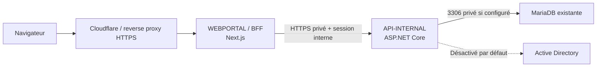

# Kermaria Client Platform

Plateforme technique de l'espace client **Zachary HOUNSA-HOUNKPA EI** pour
`clients.zacharyhounsa.ovh`. Ce dépôt reste séparé du site vitrine Astro.

## État V0.14

La V0.14 complète la conversation publique avec un centre d'activité
administrateur orienté suivi :

- un portail Next.js responsive et ses routes BFF ;
- une API ASP.NET Core privée ;
- une persistance MariaDB activable uniquement dans `API-INTERNAL` ;
- une connexion locale par e-mail et mot de passe hashé ;
- deux rôles simples : `client_user` et `internal_admin` ;
- un verrouillage temporaire après plusieurs échecs consécutifs ;
- des sessions persistées sous forme de hash et un cookie `HttpOnly` ;
- la révocation de la session courante et des autres sessions de l'utilisateur ;
- une isolation des lectures et écritures par le client issu de la session ;
- une page `/login`, une déconnexion et la protection des pages privées ;
- une interface `/admin` avec suivi contrôlé des demandes pour les comptes internes ;
- un fallback mock explicite lorsque SQL est absent en développement ;
- des migrations SQL versionnées et un seed fictif déclenchés manuellement ;
- une abstraction Active Directory en modes `disabled`, `mock`, `test` et
  `enabled`, sans opération réelle activée ;
- une corrélation `X-Correlation-Id`, des erreurs contrôlées et des audits ;
- des health checks `live` et `ready` pour les deux applications ;
- une validation stricte des configurations Production ;
- une identité interservice par `SERVICE_AUTH_TOKEN` sur `/internal/*` en
  Production ;
- une commande `npm run validate`, un garde-fou secrets et des runbooks de
  déploiement, sauvegarde, restauration et rotation ;
- un portail privé marqué `noindex, nofollow` ;
- des états de chargement, d'erreur et d'absence de données distincts ;
- des formulaires avec validation visible, timeout et anti-double soumission ;
- un parsing JSON contrôlé côté navigateur et côté BFF ;
- une présentation responsive renforcée, notamment pour les factures ;
- des messages moins techniques et plus adaptés à un espace client ;
- des statuts contrôlés et compréhensibles pour les deux types de demandes ;
- des pages de détail client sans donnée interne ;
- des pages de détail admin avec historique, note interne et message public ;
- des mutations admin limitées au statut et aux messages append-only ;
- une séparation persistée entre notes internes et messages visibles du client ;
- des notifications lors d'un changement réel de statut ;
- des notifications lors de la publication d'un message client ;
- une page `/notifications` avec états lu/non lu ;
- le marquage individuel ou global des notifications ;
- un aperçu de l'activité récente sur le dashboard ;
- des réponses client sur les demandes support et de service ;
- une conversation publique distinguant messages Kermaria et réponses client ;
- une validation 3 à 2 000 caractères et un anti-double envoi ;
- une séparation inchangée entre conversation publique et notes internes ;
- un centre d'activité admin sans contenu de message ;
- des compteurs de demandes à traiter et en attente client ;
- une détection du dernier message public envoyé par un client ;
- des filtres « À traiter » et « Réponse client » sur les listes admin ;
- des indicateurs de suivi et un rappel de confidentialité sur les détails.

Le SSO, le MFA, la récupération automatisée de mot de passe, les actions AD,
le paiement, la facturation réelle et les intégrations NAS/RDS/VPN ne sont pas
implémentés.

## État V0.15

La V0.15 ajoute un socle commercial prudent et strictement informatif :

- un catalogue d'offres administrable sans suppression définitive ;
- des documents commerciaux `draft`, `pending_review`,
  `shared_with_customer` ou `cancelled` ;
- des lignes de document calculées en centimes côté API-INTERNAL ;
- un affichage client sur `/invoices` et `/commercial-documents/[id]` ;
- des écrans admin `/admin/catalog` et `/admin/commercial-documents` ;
- un disclaimer explicite : `Document informatif - ne constitue pas une facture officielle.` ;
- l'absence de paiement, PDF légal, numérotation fiscale définitive,
  e-mail réel, provisioning ou action AD.

Les documents affichés dans cet espace restent informatifs tant que la
facturation réelle n'est pas activée.

## Architecture



Le navigateur ne contacte jamais `API-INTERNAL`, MariaDB ou AD. Les formulaires
et conversations utilisent uniquement les routes `/api/*` du BFF, qui
appellent `API-INTERNAL` côté serveur.

Le token de session est généré par `API-INTERNAL`, renvoyé une seule fois au
BFF, puis placé dans un cookie `HttpOnly`, `SameSite=Lax`. Seul son hash
SHA-256 est stocké dans `portal_sessions`. Les mots de passe utilisent le
`PasswordHasher` ASP.NET Core, fondé sur PBKDF2 avec sel.

`INTERNAL_API_URL` et `SERVICE_AUTH_TOKEN` sont strictement serveur et ne
doivent recevoir aucun préfixe public Next.js.

Le centre d'activité V0.14 est calculé à partir des demandes et messages
publics existants. Il ne copie ni le texte des messages, ni les notes internes,
et ne change jamais automatiquement le statut d'une demande.

## Structure

```text
apps/webportal/                 Portail public et BFF Next.js
apps/api-internal/              API privée ASP.NET Core
apps/api-internal/Data/         Configuration, entités et dépôts
apps/api-internal/Migrations/   Schéma MariaDB et seed fictif
apps/api-internal/Services/     Services métier et abstraction AD
packages/shared/                Contrats TypeScript non sensibles
tests/api-internal/             Smoke tests HTTP
scripts/                        Validation globale et garde-fous
docs/                           Architecture et exploitation
```

## Prérequis

- Node.js 24 LTS ou version compatible avec `package.json` ;
- npm ;
- SDK .NET 10, fixé par `global.json` ;
- MariaDB uniquement pour les tests persistants optionnels.

Ne pas utiliser `npm audit fix --force`.

## Configuration

Copier uniquement les noms utiles de `.env.example` vers des variables
d'environnement locales. Ne jamais saisir un secret dans un fichier suivi.

MariaDB est construite en mémoire à partir de `SQL_HOST`, `SQL_PORT`,
`SQL_DATABASE`, `SQL_USERNAME` et `SQL_PASSWORD`. Aucune chaîne complète n'est
attendue ni journalisée.

En `Development`, une configuration SQL absente active le dépôt mock avec un
warning sans secret. Hors `Development`, une configuration SQL absente provoque
un refus de démarrage `SQL_CONFIG_MISSING`; aucun fallback silencieux n'existe.

En Production, API-INTERNAL refuse également un mot de passe ou token absent,
un placeholder évident, `SESSION_COOKIE_SECURE=false`, un seed démo ou
`AD_INTEGRATION_MODE=enabled`. WEBPORTAL refuse ses appels internes si
`INTERNAL_API_URL` est invalide ou locale sans dérogation explicite.

`AD_INTEGRATION_MODE` vaut `disabled` par défaut :

- `disabled` : toutes les actions refusées ;
- `mock` : réponses simulées, aucun accès réseau AD ;
- `test` : validation de configuration et de périmètre, aucune mutation réelle ;
- `enabled` : validation supplémentaire obligatoire, opérations encore
  désactivées dans cette V0.9.

Variables d'authentification :

- `SESSION_COOKIE_NAME` côté `WEBPORTAL` ;
- `SESSION_COOKIE_SECURE=true` en production ;
- `SESSION_DURATION_MINUTES` côté `API-INTERNAL` ;
- `LOGIN_MAX_FAILURES` et `LOGIN_LOCKOUT_MINUTES` côté `API-INTERNAL` ;
- `DEMO_PORTAL_EMAIL` et `DEMO_PORTAL_PASSWORD` uniquement pour le seed manuel
  client en `Development` ;
- `DEMO_INTERNAL_ADMIN_EMAIL` et `DEMO_INTERNAL_ADMIN_PASSWORD` uniquement
  pour le seed interne en `Development`.

## Développement

Démarrer API-INTERNAL en fallback mock :

```powershell
$env:ASPNETCORE_ENVIRONMENT="Development"
$env:AD_INTEGRATION_MODE="disabled"
$env:DEMO_PORTAL_EMAIL="demo.user@example.invalid"
$env:DEMO_PORTAL_PASSWORD="**INJECTER_LOCALEMENT**"
$env:DEMO_INTERNAL_ADMIN_EMAIL="demo.admin@example.invalid"
$env:DEMO_INTERNAL_ADMIN_PASSWORD="**INJECTER_LOCALEMENT**"
dotnet run --project apps/api-internal/Kermaria.ApiInternal.csproj --urls http://localhost:5000
```

Démarrer WEBPORTAL :

```powershell
$env:INTERNAL_API_URL="http://localhost:5000"
$env:ALLOW_LOCAL_INTERNAL_API_URL="true"
npm run dev:web
```

Sous PowerShell restrictif, remplacer `npm` par `npm.cmd`.

## MariaDB

Installer le schéma et, facultativement, les données fictives uniquement par
commande explicite en développement :

```powershell
dotnet run --project apps/api-internal/Kermaria.ApiInternal.csproj -- --apply-migrations
dotnet run --project apps/api-internal/Kermaria.ApiInternal.csproj -- --apply-migrations --seed-demo-data
```

Ces commandes exigent toutes les variables `SQL_*`. Le démarrage normal
n'applique jamais automatiquement une migration.

`--seed-demo-data` configure les comptes client et interne uniquement si leurs
variables `DEMO_*` sont injectées. Les mots de passe ne sont ni affichés ni
écrits en clair. La migration `003_admin_and_auth_hardening.sql` ajoute le
rôle et l'état de verrouillage sans supprimer les données existantes.
La migration `004_request_workflow.sql` ajoute les événements, notes internes
et messages publics, puis initialise un événement `created` pour les demandes
existantes.
La migration `005_portal_notifications.sql` ajoute une table de notifications
isolée par client. Elle n'ajoute aucune notification externe ou tâche de fond.
La V0.13 ne nécessite aucune migration : `request_public_messages` possède déjà
un `author_user_id` permettant de distinguer administrateur et client.

Les tests MariaDB sont opt-in. Ils créent des sessions et demandes fictives,
ainsi qu'un client d'isolation temporaire supprimé en fin de test :

```powershell
$env:RUN_MARIADB_TESTS="true"
npm run test:api
```

Ils sont ignorés si `RUN_MARIADB_TESTS` n'est pas explicitement activé.
La commande portable `npm run validate:mariadb` active ce mode après avoir
vérifié que les variables requises sont présentes.

## Vérifications

```powershell
npm run validate
```

Cette commande exécute le scan de secrets, lint, typechecks, builds, smoke tests
API et contrats BFF, administration, exploitation et UX client. Les tests
MariaDB réels restent volontairement séparés.

Cette commande exécute aussi le contrat web V0.15 du socle commercial
informatif en plus des contrats BFF, administration, exploitation et UX client.

Health checks :

- API : `/health/live`, `/health/ready` et `/health` pour compatibilité ;
- WEBPORTAL : `/api/health/live`, `/api/health/ready` et `/api/health`.

Une readiness en échec retourne HTTP 503. La readiness API exécute `SELECT 1`
si MariaDB est configurée ; la readiness WEBPORTAL vérifie API-INTERNAL côté
serveur sans exposer son URL.

La migration `006_commercial_foundation.sql` ajoute `commercial_offers`,
`commercial_documents` et `commercial_document_lines` sans activer de
facturation légale ni de paiement.

## Routes

Pages publiques : `/` et `/login`.

Pages privées : `/dashboard`, `/services`, `/invoices`, `/support`,
`/support/[id]`, `/request-service`, `/request-service/[id]`,
`/notifications`, `/profile` et `/password`.

Pages internes, réservées à `internal_admin` : `/admin`,
`/admin/customers`, `/admin/support-requests`, `/admin/service-requests`,
leurs pages de détail, `/admin/sessions` et `/admin/audit-logs`.

V0.15 ajoute les pages `/commercial-documents/[id]`, `/admin/catalog`,
`/admin/commercial-documents` et `/admin/commercial-documents/[id]` pour le
catalogue d'offres et les documents commerciaux informatifs.

Routes BFF :

- `GET /api/health`
- `GET /api/health/live`
- `GET /api/health/ready`
- `POST /api/auth/login`
- `POST /api/auth/logout`
- `POST /api/auth/revoke-other-sessions`
- `GET /api/auth/me`
- `POST /api/support-requests`
- `POST /api/support-requests/[id]/messages`
- `POST /api/service-requests`
- `POST /api/service-requests/[id]/messages`
- `GET /api/notifications`
- `POST /api/notifications/[id]/read`
- `POST /api/notifications/read-all`
- `GET /api/admin/overview`
- `GET /api/admin/activity`
- `GET /api/admin/customers`
- `GET /api/admin/support-requests`
- `GET /api/admin/service-requests`
- `GET /api/admin/support-requests/[id]`
- `PATCH /api/admin/support-requests/[id]/status`
- `POST /api/admin/support-requests/[id]/notes`
- `POST /api/admin/support-requests/[id]/messages`
- `GET /api/admin/service-requests/[id]`
- `PATCH /api/admin/service-requests/[id]/status`
- `POST /api/admin/service-requests/[id]/notes`
- `POST /api/admin/service-requests/[id]/messages`
- `GET /api/admin/sessions`
- `GET /api/admin/audit-logs`

Les routes `GET|POST /internal/*` sont strictement privées et exigent
`X-Service-Auth` en Production. Voir
[le contrat d'API](docs/API_CONTRACT.md).

## Sécurité

- `API-INTERNAL` ne doit jamais être publiée sur Internet.
- MariaDB et AD sont accessibles uniquement depuis `API-INTERNAL`.
- Les secrets proviennent uniquement de l'environnement.
- Les mots de passe bruts, tokens et chaînes de connexion ne sont pas loggés.
- Aucun token de session brut n'est stocké dans MariaDB.
- Aucun token ni hash de session n'est exposé dans les vues admin.
- Les notes internes ne sont jamais incluses dans les contrats client.
- Les messages admin et réponses client sont rendus comme texte brut, jamais
  comme HTML ou Markdown interprété.
- Une réponse client est autorisée uniquement lorsque la demande appartient au
  `customer_id` issu de sa session.
- Les notifications contiennent uniquement des textes courts et non sensibles.
- Une notification est toujours filtrée par le client issu de la session.
- Le `customer_id` vient uniquement de la session validée par API-INTERNAL.
- `client_user` est refusé sur les routes admin ; `internal_admin` est refusé
  sur les vues métier client pour éviter toute confusion de contexte.
- Les headers `nosniff`, `DENY`, `Referrer-Policy` et une CSP limitée aux
  protections de cadrage, base et formulaires sont appliqués par WEBPORTAL.
- `X-Robots-Tag: noindex, nofollow` et `robots.txt` bloquent l'indexation du
  portail privé.
- Les secrets de développement précédemment exposés doivent être tournés selon
  la procédure documentée avant toute pré-production.
- L'OU de test autorisée est `OU=TEST_SITE_WEB,DC=home,DC=bzh`.
- L'OU de production `KoXoAdm` est hors périmètre et explicitement refusée.
- Aucun paiement ni aucune facturation réelle n'est ajouté.

## Documentation

- [Architecture](docs/ARCHITECTURE.md)
- [Sécurité](docs/SECURITY.md)
- [Stack technique](docs/TECH_STACK.md)
- [Règles réseau](docs/NETWORK_RULES.md)
- [Feuille de route](docs/ROADMAP.md)
- [Contrat d'API](docs/API_CONTRACT.md)
- [Modèle de données](docs/DATA_MODEL.md)
- [Déploiement](docs/DEPLOYMENT.md)
- [Exploitation](docs/OPERATIONS.md)
- [Sauvegarde et restauration](docs/BACKUP_RESTORE.md)
- [Rotation des secrets](docs/SECRET_ROTATION.md)
- [UX client V0.10](docs/V0.10_UX_CLIENT.md)
- [Workflow demandes V0.11](docs/V0.11_REQUEST_WORKFLOW.md)
- [Notifications portail V0.12](docs/V0.12_PORTAL_NOTIFICATIONS.md)
- [Réponses client V0.13](docs/V0.13_CLIENT_REPLIES.md)
- [Centre d'activité admin V0.14](docs/V0.14_ADMIN_ACTIVITY.md)
- [Règles permanentes](AGENTS.md)
