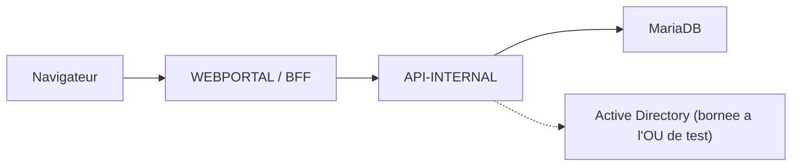

# Kermaria Client Platform

Plateforme technique de l'espace client **Zachary HOUNSA-HOUNKPA EI** pour
`clients.zacharyhounsa.ovh`.

Ce depot reste separe du site vitrine Astro et conserve une architecture
obligatoire :

```text
browser -> WEBPORTAL / BFF -> API-INTERNAL -> MariaDB
```

`WEBPORTAL` ne doit jamais acceder directement a MariaDB.

## Etat courant V0.25

Le depot couvre aujourd'hui les jalons V0.9 a V0.23.1 (voir
[`docs/ROADMAP.md`](docs/ROADMAP.md)). L'integration BPCE de la V0.20
emet de vraies factures fiscales (mode `live` desactive par defaut, en
phase de tests), la V0.21 ouvre les canaux de paiement client one-shot,
la V0.22 ajoute les abonnements PayPal recurrents, et les V0.23/V0.23.1
harmonisent l'UX cote client et admin.

Acquis V0.23 et V0.23.1 (harmonisation UX,
[`docs/V0.23_HARMONISATION_UX.md`](docs/V0.23_HARMONISATION_UX.md)) :

- navigation laterale gauche unifiee (sidebar) cote portail client et
  cote administration, exposant **toutes** les pages disponibles ;
- dashboard admin nettoye, flux d'activite publique extrait dans
  `/admin/activity`, journal d'audit a `/admin/audit-logs` ;
- catalogue admin refondu : liste tabulaire `/admin/catalog`, fiche
  d'edition `/admin/catalog/[id]`, creation `/admin/catalog/new` ;
- bouton Desactiver/Reactiver l'offre (soft-delete via PATCH
  `status: inactive`, pas d'API DELETE) ;
- page support cote client en zone centrale (formulaire en haut,
  liste empilee dessous) ;
- harmonisation visuelle paiements/abonnements (meme bandeau
  metriques + bloc filtres) ;
- elargissement global a 1480 px, bouton "Consulter" toujours visible
  sans scroll horizontal, filtres harmonises (label au-dessus,
  arrondis), libelles AD en francais sur la fiche client.

Acquis V0.22 et V0.22.1 (abonnements PayPal,
[`docs/V0.22_SUBSCRIPTIONS.md`](docs/V0.22_SUBSCRIPTIONS.md)) :

- facturation automatique mensuelle via PayPal Subscriptions API,
  flow client `/services` -> "Souscrire" -> approbation PayPal ->
  webhook `ACTIVATED` -> `PAYMENT.SALE.COMPLETED` ;
- webhook `POST /api/webhooks/paypal` avec verification de signature
  PayPal (skippable en sandbox local) et idempotence par `event_id` ;
- creation automatique du document `informational_invoice` + facture
  BPCE mock + email `payment_confirmed` a chaque paiement recurrent ;
- admin `/admin/subscriptions` (filtre statut/client + MRR HT estime),
  bouton "Annuler" (cancel PayPal + audit) sur `/admin/subscriptions/{id}` ;
- creation automatique des Plans PayPal depuis l'admin (V0.22.1) :
  `paypal_plan_id_sandbox` + `paypal_plan_id_live`, bouton "Creer le
  plan PayPal" sur la fiche offre, prix fige une fois un plan cree ;
- mode `PAYPAL_MODE=live` reste interdit avant V1.0 beta 1.

Acquis V0.20 et V0.21 (facturation et paiements one-shot) :

- facturation reelle via l'API BPCE Banque Populaire avec numerotation
  fiscale, validation immuable et PDF cache localement
  ([`docs/V0.20_BPCE_INVOICING.md`](docs/V0.20_BPCE_INVOICING.md)) ;
- modes `BPCE_INTEGRATION_MODE` : `disabled` (defaut) / `mock` / `live` ;
- import de 17 articles catalogue avec `external_reference` et taux TVA
  indicatif (V0.20.1) ;
- section `Reglement` cote portail client avec IBAN/BIC ;
- paiement carte / PayPal one-shot via PayPal Orders API v2
  (`intent: CAPTURE`), modes `PAYPAL_MODE=sandbox|live` ;
- telechargement PDF cote portail client (V0.21), vue admin
  `/admin/payments` (totaux a regler/regle + filtre statut) ;
- canal e-mail transactionnel `EMAIL_INTEGRATION_MODE` =
  `disabled` (defaut) / `mock` / `live`, 3 templates texte
  (invoice_issued, payment_reminder, payment_confirmed),
  journal `/admin/email-log`
  ([`docs/V0.21_PAYMENT_CHANNELS.md`](docs/V0.21_PAYMENT_CHANNELS.md)).

Acquis V0.25 (finalisation Active Directory, livre 2026-06-30,
[`docs/V0.25_AD_FINALISATION.md`](docs/V0.25_AD_FINALISATION.md)) :

- brique 3 : procedure de sortie d'OU vers production
  ([`docs/AD_PRODUCTION_MIGRATION.md`](docs/AD_PRODUCTION_MIGRATION.md))
  redigee, executable en V1.0 RC seulement ;
- brique 2 : provisioning AD etendu dans `OU=TEST_SITE_WEB` (lecture
  groupes effectifs directs+transitifs, rename user
  CN/sAM/displayName/UPN, move user Users<->Disabled meme client OU
  cross-client). UI : 3 nouvelles SectionCards dans la fiche client ;
- brique 1 : changement de mot de passe AD client depuis `/password`,
  derriere flag `AD_PASSWORD_CHANGE_ENABLED=true` (defaut `false`),
  policy AD du domaine = seule source de verite (aucune regle
  longueur/complexite cote API), rate limit 3 echecs / 15 min avec
  blocage 15 min, audit `ad.password_change.*`, aucun mot de passe en
  log ni en cache.

Acquis V0.18 et V0.19 (toujours actifs) :

- modes AD `disabled`, `mock`, `read_only` et `controlled_write` bornes a
  l'OU de test `OU=TEST_SITE_WEB,DC=home,DC=bzh` ;
- mutations BFF admin sensibles protegees par un jeton CSRF cote serveur ;
- `X-Service-Auth` exige sur `/internal/*` dans tout environnement non
  `Development` ;
- validateur d'entrees AD strict cote `API-INTERNAL`.

Le mode `live` BPCE/PayPal/EMAIL n'est jamais active sans validation
explicite (V1.0 beta 1, R740xd).

Le projet reste en **phase de tests** sur SRV-01 et SRV-02 tant que la
cible R740xd n'est pas livree : aucun client reel, aucun envoi e-mail
externe a un destinataire reel, aucun prelevement recurrent active.

## Architecture



Rappels importants :

- le navigateur parle uniquement a `WEBPORTAL` ;
- `INTERNAL_API_URL` et `SERVICE_AUTH_TOKEN` restent server-only ;
- les sessions sont portées par un cookie `HttpOnly` ;
- aucun token de session ne doit etre stocke en `localStorage` ou
  `sessionStorage`.

## Structure

```text
apps/webportal/                 Portail Next.js et routes BFF
apps/api-internal/              API ASP.NET Core privee
packages/shared/                Contrats TypeScript non sensibles
tests/api-internal/             Smoke tests HTTP
scripts/                        Validation globale et garde-fous
docs/                           Architecture, securite et exploitation
```

## Prerequis

- Node.js 24 LTS ou compatible ;
- npm ;
- SDK .NET 10 ;
- MariaDB uniquement pour les tests persistants opt-in.

Ne pas utiliser `npm audit fix --force`.

## Configuration

Copier uniquement les noms utiles de `.env.example` vers des variables
d'environnement locales. Ne jamais stocker de vrai secret dans un fichier
suivi.

Variables critiques WEBPORTAL :

- `INTERNAL_API_URL`
- `SERVICE_AUTH_TOKEN`
- `SESSION_COOKIE_NAME`
- `SESSION_COOKIE_SECURE`
- `SESSION_COOKIE_SAME_SITE`

Variables critiques API-INTERNAL :

- `ASPNETCORE_ENVIRONMENT`
- `DOTNET_ENVIRONMENT`
- `SQL_PROVIDER`, `SQL_HOST`, `SQL_PORT`, `SQL_DATABASE`, `SQL_USERNAME`,
  `SQL_PASSWORD`
- `SERVICE_AUTH_TOKEN`
- `SESSION_DURATION_MINUTES`
- `LOGIN_MAX_FAILURES`
- `LOGIN_LOCKOUT_MINUTES`
- `AD_INTEGRATION_MODE=disabled|mock|read_only|controlled_write`
- `AD_DOMAIN`
- `AD_CLIENTS_OU_DN`
- `AD_SERVICE_ACCOUNT_USERNAME`
- `AD_SERVICE_ACCOUNT_PASSWORD`
- `AD_PASSWORD_CHANGE_ENABLED=true|false` (defaut `false`, V0.25 brique 1)
- `AD_PASSWORD_RATE_LIMIT_PER_15MIN=3` (defaut, V0.25 brique 1)
- `BPCE_INTEGRATION_MODE=disabled|mock|live`
- `BPCE_BASE_URL`, `BPCE_REFRESH_TOKEN`, `BPCE_SENDER_ID`
- `LOG_FILE_DIRECTORY`, `LOG_FILE_LEVEL`, `LOG_FILE_RETENTION_DAYS`
  (rotation quotidienne, voir `apps/api-internal/Infrastructure/FileLoggerProvider.cs`)

Variables paiement et reglement (V0.21 / V0.22) :

- `PAYPAL_MODE=sandbox|live`
- `PAYPAL_CLIENT_ID`
- `PAYPAL_CLIENT_SECRET`
- `PAYPAL_WEBHOOK_ID` (V0.22, requis pour la verification webhook)
- `PAYPAL_WEBHOOK_VERIFY=true|false` (V0.22, skippable en sandbox local
  uniquement)
- `BILLING_IBAN`, `BILLING_BIC`, `BILLING_TRANSFER_LABEL`
- `BILLING_PAYPAL_URL` (fallback PayPal.me)

Variables e-mail transactionnel (V0.21) :

- `EMAIL_INTEGRATION_MODE=disabled|mock|live` (defaut `disabled`)
- `SMTP_HOST`, `SMTP_PORT` (defaut 587)
- `SMTP_USE_STARTTLS=true|false` (defaut `true`)
- `SMTP_USERNAME`, `SMTP_PASSWORD`
- `SMTP_FROM_ADDRESS`, `SMTP_FROM_DISPLAY_NAME`
- `SMTP_TIMEOUT_MS`

## Developpement local

API-INTERNAL :

```powershell
$env:ASPNETCORE_ENVIRONMENT="Development"
$env:DOTNET_ENVIRONMENT="Development"
$env:AD_INTEGRATION_MODE="disabled"
dotnet run --project apps/api-internal/Kermaria.ApiInternal.csproj --urls http://localhost:5000
```

WEBPORTAL :

```powershell
$env:INTERNAL_API_URL="http://localhost:5000"
$env:ALLOW_LOCAL_INTERNAL_API_URL="true"
npm run dev:web
```

Sous PowerShell restrictif, utiliser `npm.cmd`.

## Verification

Verifications locales rapides (typecheck + lint webportal) :

```powershell
npm run typecheck:webportal
npm run lint:webportal
```

Validation globale (typecheck + lint + build + tests contrats) :

```powershell
npm run validate
```

Validation staging :

```powershell
npm run validate:staging
```

Validation preproduction :

```powershell
npm run validate:preprod
```

Validation MariaDB opt-in :

```powershell
npm run validate:mariadb
```

Health checks :

```powershell
npm run check:health
```

Tests contrat ciblés (sans MariaDB requise) :

```powershell
npm run test:bpce          # facturation BPCE V0.20
npm run test:payments      # canaux paiement V0.21
npm run test:subscriptions # abonnements PayPal V0.22
npm run test:activity      # flux activite admin
npm run test:ad-security   # garde-fous AD
```

## Contraintes permanentes

- ne pas changer l'architecture ;
- ne pas connecter `WEBPORTAL` directement a MariaDB ;
- ne pas activer l'AD hors de l'OU de test validee ;
- ne pas exposer de hard delete AD ;
- ne pas activer `BPCE_INTEGRATION_MODE=live`, `PAYPAL_MODE=live` ou
  `EMAIL_INTEGRATION_MODE=live` sans validation explicite (cible
  R740xd, V1.0 beta 1) ;
- ne pas ajouter de prelevement SEPA hors PayPal, d'e-mail automatique,
  de SMS, push, WebSocket ou provisioning declenche par un encaissement ;
- ne pas logger tokens, cookies, mots de passe, chaines de connexion,
  secrets BPCE (`BPCE_REFRESH_TOKEN`), credentials PayPal ni montants de
  facture complets.

## Documentation

- [Architecture](docs/ARCHITECTURE.md)
- [API contract](docs/API_CONTRACT.md)
- [Data model](docs/DATA_MODEL.md)
- [Security](docs/SECURITY.md)
- [Deployment](docs/DEPLOYMENT.md)
- [Operations](docs/OPERATIONS.md)
- [Backup and restore](docs/BACKUP_RESTORE.md)
- [Roadmap](docs/ROADMAP.md)
- [BPCE invoicing V0.20](docs/V0.20_BPCE_INVOICING.md)
- [Payment channels V0.21](docs/V0.21_PAYMENT_CHANNELS.md)
- [Subscriptions V0.22](docs/V0.22_SUBSCRIPTIONS.md)
- [Harmonisation UX V0.23](docs/V0.23_HARMONISATION_UX.md)
- [Cadrage AD finalisation V0.25](docs/V0.25_AD_FINALISATION.md)
- [Procedure sortie OU AD prod (V0.25 brique 3)](docs/AD_PRODUCTION_MIGRATION.md)
- [Cadrage self-service signup V0.26](docs/V0.26_SELF_SERVICE_SIGNUP.md)
- [Cadrage site vitrine public V0.27](docs/V0.27_PUBLIC_VITRINE.md)
- [Active Directory security hardening V0.19](docs/V0.19_AD_SECURITY_HARDENING.md)
- [Active Directory controlled write V0.18](docs/V0.18_ACTIVE_DIRECTORY_CONTROLLED_WRITE.md)
- [Preproduction technique V0.16](docs/V0.16_PREPRODUCTION_TECHNIQUE.md)
- [Recette preproduction V0.17](docs/V0.17_RECETTE_PREPRODUCTION.md)
- [Secret rotation](docs/SECRET_ROTATION.md)
- [Permanent rules](AGENTS.md)
