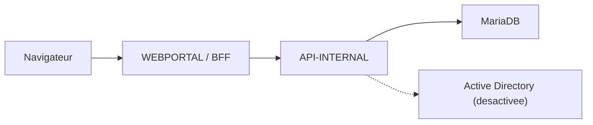

# Kermaria Client Platform

Plateforme technique de l'espace client **Zachary HOUNSA-HOUNKPA EI** pour
`clients.zacharyhounsa.ovh`.

Ce depot reste separe du site vitrine Astro et conserve une architecture
obligatoire :

```text
browser -> WEBPORTAL / BFF -> API-INTERNAL -> MariaDB
```

`WEBPORTAL` ne doit jamais acceder directement a MariaDB.

## Etat V0.17

La V0.17 consolide la preparation d'une vraie recette preproduction sans
ouvrir de nouvelles integrations sensibles :

- fiche client admin consolidee avec identite, statut, services, demandes,
  documents commerciaux, factures, activite recente et audits ;
- isolation `customer_id` renforcee par des validations d'identifiants cote
  BFF et API ;
- durcissement pre-prod des cookies, de la readiness et des headers
  WEBPORTAL ;
- validation dediee `npm run validate:staging` pour distinguer staging et
  production ;
- documentation de staging et document de recette
  `docs/V0.17_RECETTE_PREPRODUCTION.md`.

La V0.17 n'ajoute toujours ni AD reelle, ni paiement, ni facturation fiscale
reelle, ni e-mail automatique, ni SMS, ni push, ni WebSocket, ni provisioning,
ni suppression client destructive.

## Architecture



Rappels importants :

- le navigateur parle uniquement a `WEBPORTAL` ;
- `INTERNAL_API_URL` et `SERVICE_AUTH_TOKEN` restent server-only ;
- les sessions sont portées par un cookie `HttpOnly` ;
- aucun token de session ne doit etre stocke en `localStorage` ou
  `sessionStorage`.

## Structure

```text
apps/webportal/                 Portail Next.js et routes BFF
apps/api-internal/              API ASP.NET Core privee
packages/shared/                Contrats TypeScript non sensibles
tests/api-internal/             Smoke tests HTTP
scripts/                        Validation globale et garde-fous
docs/                           Architecture, securite et exploitation
```

## Prerequis

- Node.js 24 LTS ou compatible ;
- npm ;
- SDK .NET 10 ;
- MariaDB uniquement pour les tests persistants opt-in.

Ne pas utiliser `npm audit fix --force`.

## Configuration

Copier uniquement les noms utiles de `.env.example` vers des variables
d'environnement locales. Ne jamais stocker de vrai secret dans un fichier
suivi.

Variables critiques WEBPORTAL :

- `INTERNAL_API_URL`
- `SERVICE_AUTH_TOKEN`
- `SESSION_COOKIE_NAME`
- `SESSION_COOKIE_SECURE`
- `SESSION_COOKIE_SAME_SITE`

Variables critiques API-INTERNAL :

- `ASPNETCORE_ENVIRONMENT`
- `DOTNET_ENVIRONMENT`
- `SQL_PROVIDER`, `SQL_HOST`, `SQL_PORT`, `SQL_DATABASE`, `SQL_USERNAME`,
  `SQL_PASSWORD`
- `SERVICE_AUTH_TOKEN`
- `SESSION_DURATION_MINUTES`
- `LOGIN_MAX_FAILURES`
- `LOGIN_LOCKOUT_MINUTES`
- `AD_INTEGRATION_MODE=disabled`

## Developpement local

API-INTERNAL :

```powershell
$env:ASPNETCORE_ENVIRONMENT="Development"
$env:DOTNET_ENVIRONMENT="Development"
$env:AD_INTEGRATION_MODE="disabled"
dotnet run --project apps/api-internal/Kermaria.ApiInternal.csproj --urls http://localhost:5000
```

WEBPORTAL :

```powershell
$env:INTERNAL_API_URL="http://localhost:5000"
$env:ALLOW_LOCAL_INTERNAL_API_URL="true"
npm run dev:web
```

Sous PowerShell restrictif, utiliser `npm.cmd`.

## Verification

Validation globale :

```powershell
npm run validate
```

Validation staging :

```powershell
npm run validate:staging
```

Validation preproduction :

```powershell
npm run validate:preprod
```

Validation MariaDB opt-in :

```powershell
npm run validate:mariadb
```

Health checks :

```powershell
npm run check:health
```

## Contraintes permanentes

- ne pas changer l'architecture ;
- ne pas connecter `WEBPORTAL` directement a MariaDB ;
- ne pas activer l'AD reelle ;
- ne pas ajouter paiement reel, facturation fiscale reelle, e-mail automatique,
  SMS, push, WebSocket ou provisioning ;
- ne pas logger tokens, cookies, mots de passe, chaines de connexion ou
  secrets.

## Documentation

- [Architecture](docs/ARCHITECTURE.md)
- [API contract](docs/API_CONTRACT.md)
- [Data model](docs/DATA_MODEL.md)
- [Security](docs/SECURITY.md)
- [Deployment](docs/DEPLOYMENT.md)
- [Operations](docs/OPERATIONS.md)
- [Backup and restore](docs/BACKUP_RESTORE.md)
- [Roadmap](docs/ROADMAP.md)
- [Preproduction technique V0.16](docs/V0.16_PREPRODUCTION_TECHNIQUE.md)
- [Recette preproduction V0.17](docs/V0.17_RECETTE_PREPRODUCTION.md)
- [Secret rotation](docs/SECRET_ROTATION.md)
- [Permanent rules](AGENTS.md)
