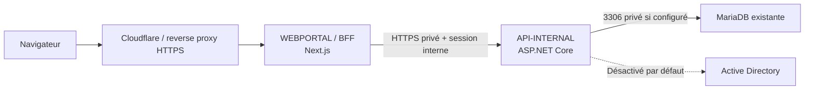

# Kermaria Client Platform

Plateforme technique de l'espace client **Zachary HOUNSA-HOUNKPA EI** pour
`clients.zacharyhounsa.ovh`. Ce dépôt reste séparé du site vitrine Astro.

## État V0.7

La V0.7 fournit :

- un portail Next.js responsive et ses routes BFF ;
- une API ASP.NET Core privée ;
- une persistance MariaDB activable uniquement dans `API-INTERNAL` ;
- une connexion locale par e-mail et mot de passe hashé ;
- des sessions persistées sous forme de hash et un cookie `HttpOnly` ;
- une isolation des lectures et écritures par le client issu de la session ;
- une page `/login`, une déconnexion et la protection des pages privées ;
- un fallback mock explicite lorsque SQL est absent en développement ;
- des migrations SQL versionnées et un seed fictif déclenchés manuellement ;
- une abstraction Active Directory en modes `disabled`, `mock`, `test` et
  `enabled`, sans opération réelle activée ;
- une corrélation `X-Correlation-Id`, des erreurs contrôlées et des audits.

Le SSO, le MFA, la récupération automatisée de mot de passe, les actions AD,
le paiement, la facturation réelle et les intégrations NAS/RDS/VPN ne sont pas
implémentés.

## Architecture



Le navigateur ne contacte jamais `API-INTERNAL`, MariaDB ou AD. Les formulaires
utilisent `/api/support-requests` et `/api/service-requests`; ces routes BFF
appellent `API-INTERNAL` côté serveur.

Le token de session est généré par `API-INTERNAL`, renvoyé une seule fois au
BFF, puis placé dans un cookie `HttpOnly`, `SameSite=Lax`. Seul son hash
SHA-256 est stocké dans `portal_sessions`. Les mots de passe utilisent le
`PasswordHasher` ASP.NET Core, fondé sur PBKDF2 avec sel.

`INTERNAL_API_URL` est strictement serveur et ne doit recevoir aucun préfixe
public Next.js.

## Structure

```text
apps/webportal/                 Portail public et BFF Next.js
apps/api-internal/              API privée ASP.NET Core
apps/api-internal/Data/         Configuration, entités et dépôts
apps/api-internal/Migrations/   Schéma MariaDB et seed fictif
apps/api-internal/Services/     Services métier et abstraction AD
packages/shared/                Contrats TypeScript non sensibles
tests/api-internal/             Smoke tests HTTP
docs/                           Architecture et exploitation
```

## Prérequis

- Node.js 24 LTS ou version compatible avec `package.json` ;
- npm ;
- SDK .NET 10, fixé par `global.json` ;
- MariaDB uniquement pour les tests persistants optionnels.

Ne pas utiliser `npm audit fix --force`.

## Configuration

Copier uniquement les noms utiles de `.env.example` vers des variables
d'environnement locales. Ne jamais saisir un secret dans un fichier suivi.

MariaDB est construite en mémoire à partir de `SQL_HOST`, `SQL_PORT`,
`SQL_DATABASE`, `SQL_USERNAME` et `SQL_PASSWORD`. Aucune chaîne complète n'est
attendue ni journalisée.

En `Development`, une configuration SQL absente active le dépôt mock avec un
warning sans secret. Hors `Development`, une configuration SQL absente provoque
un refus de démarrage `SQL_CONFIG_MISSING`; aucun fallback silencieux n'existe.

`AD_INTEGRATION_MODE` vaut `disabled` par défaut :

- `disabled` : toutes les actions refusées ;
- `mock` : réponses simulées, aucun accès réseau AD ;
- `test` : validation de configuration et de périmètre, aucune mutation réelle ;
- `enabled` : validation supplémentaire obligatoire, opérations encore
  désactivées dans cette V0.7.

Variables d'authentification :

- `SESSION_COOKIE_NAME` côté `WEBPORTAL` ;
- `SESSION_COOKIE_SECURE=true` en production ;
- `SESSION_DURATION_MINUTES` côté `API-INTERNAL` ;
- `DEMO_PORTAL_EMAIL` et `DEMO_PORTAL_PASSWORD` uniquement pour le seed manuel
  en `Development`.

## Développement

Démarrer API-INTERNAL en fallback mock :

```powershell
$env:ASPNETCORE_ENVIRONMENT="Development"
$env:AD_INTEGRATION_MODE="disabled"
$env:DEMO_PORTAL_EMAIL="demo.user@example.invalid"
$env:DEMO_PORTAL_PASSWORD="**INJECTER_LOCALEMENT**"
dotnet run --project apps/api-internal/Kermaria.ApiInternal.csproj --urls http://localhost:5000
```

Démarrer WEBPORTAL :

```powershell
$env:INTERNAL_API_URL="http://localhost:5000"
npm run dev:web
```

Sous PowerShell restrictif, remplacer `npm` par `npm.cmd`.

## MariaDB

Installer le schéma et, facultativement, les données fictives uniquement par
commande explicite en développement :

```powershell
dotnet run --project apps/api-internal/Kermaria.ApiInternal.csproj -- --apply-migrations
dotnet run --project apps/api-internal/Kermaria.ApiInternal.csproj -- --apply-migrations --seed-demo-data
```

Ces commandes exigent toutes les variables `SQL_*`. Le démarrage normal
n'applique jamais automatiquement une migration.

`--seed-demo-data` configure un utilisateur local seulement si
`DEMO_PORTAL_EMAIL` et `DEMO_PORTAL_PASSWORD` sont injectées. Le mot de passe
n'est ni affiché ni écrit en clair.

Les tests MariaDB sont opt-in. Ils créent des sessions et demandes fictives,
ainsi qu'un client d'isolation temporaire supprimé en fin de test :

```powershell
$env:RUN_MARIADB_TESTS="true"
npm run test:api
```

Ils sont ignorés si `RUN_MARIADB_TESTS` n'est pas explicitement activé.

## Vérifications

```powershell
npm run lint:web
npm run build:web
npm run build:api
npm run test:api
npm run build
npm --prefix apps/webportal run test:forms
npm --prefix apps/webportal run test:auth
```

## Routes

Pages publiques : `/` et `/login`.

Pages privées : `/dashboard`, `/services`, `/invoices`, `/support`,
`/request-service`, `/profile` et `/password`.

Routes BFF :

- `GET /api/health`
- `POST /api/auth/login`
- `POST /api/auth/logout`
- `GET /api/auth/me`
- `POST /api/support-requests`
- `POST /api/service-requests`

Les routes `GET|POST /internal/portal/*` et `GET|POST /internal/ad/*` sont
strictement privées. Voir [le contrat d'API](docs/API_CONTRACT.md).

## Sécurité

- `API-INTERNAL` ne doit jamais être publiée sur Internet.
- MariaDB et AD sont accessibles uniquement depuis `API-INTERNAL`.
- Les secrets proviennent uniquement de l'environnement.
- Les mots de passe bruts, tokens et chaînes de connexion ne sont pas loggés.
- Aucun token de session brut n'est stocké dans MariaDB.
- Le `customer_id` vient uniquement de la session validée par API-INTERNAL.
- L'OU de test autorisée est `OU=TEST_SITE_WEB,DC=home,DC=bzh`.
- L'OU de production `KoXoAdm` est hors périmètre et explicitement refusée.
- Aucun paiement ni aucune facturation réelle n'est ajouté.

## Documentation

- [Architecture](docs/ARCHITECTURE.md)
- [Sécurité](docs/SECURITY.md)
- [Stack technique](docs/TECH_STACK.md)
- [Règles réseau](docs/NETWORK_RULES.md)
- [Feuille de route](docs/ROADMAP.md)
- [Contrat d'API](docs/API_CONTRACT.md)
- [Modèle de données](docs/DATA_MODEL.md)
- [Déploiement](docs/DEPLOYMENT.md)
- [Règles permanentes](AGENTS.md)
