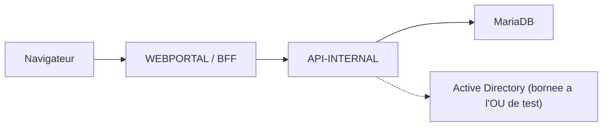

# Kermaria Client Platform

Plateforme technique de l'espace client **Zachary HOUNSA-HOUNKPA EI** pour
`clients.zacharyhounsa.ovh`.

Ce depot reste separe du site vitrine Astro et conserve une architecture
obligatoire :

```text
browser -> WEBPORTAL / BFF -> API-INTERNAL -> MariaDB
```

`WEBPORTAL` ne doit jamais acceder directement a MariaDB.

## Etat courant V0.21

Le depot couvre aujourd'hui les jalons V0.9 a V0.21 (V0.21 partiellement,
voir [`docs/ROADMAP.md`](docs/ROADMAP.md)). L'integration BPCE de la V0.20
emet de vraies factures fiscales (mode `live` desactive par defaut, en
phase de tests) et la V0.21 ouvre les canaux de paiement client.

Acquis V0.20 :

- facturation reelle via l'API BPCE Banque Populaire avec numerotation
  fiscale, validation immuable et PDF cache localement
  ([`docs/V0.20_BPCE_INVOICING.md`](docs/V0.20_BPCE_INVOICING.md)) ;
- modes `BPCE_INTEGRATION_MODE` : `disabled` (defaut) / `mock` / `live` ;
- double persistance `bpce_customers` / `bpce_invoices` independante de
  la disponibilite de l'API banque ;
- commande CLI `--verify-bpce-sender` lecture seule pour la configuration ;
- import de 17 articles catalogue avec `external_reference` et taux TVA
  indicatif (V0.20.1).

Acquis V0.21 :

- section `Reglement` cote portail client avec IBAN, BIC, libelle et
  reference a indiquer (variables `BILLING_*`) ;
- paiement carte / PayPal via PayPal Orders API v2 (`intent: CAPTURE`,
  one-shot, jamais recurrent), modes `PAYPAL_MODE=sandbox|live` ;
- confirmation paiement propagee a BPCE (`mark_as_paid`) et au statut
  local `paid` ;
- bouton PayPal masque apres paiement, message de confirmation affiche
  ([`docs/V0.21_PAYMENT_CHANNELS.md`](docs/V0.21_PAYMENT_CHANNELS.md)).

Acquis V0.18 et V0.19 (toujours actifs) :

- modes AD `disabled`, `mock`, `read_only` et `controlled_write` bornes a
  l'OU de test `OU=TEST_SITE_WEB,DC=home,DC=bzh` ;
- mutations BFF admin sensibles protegees par un jeton CSRF cote serveur ;
- `X-Service-Auth` exige sur `/internal/*` dans tout environnement non
  `Development` ;
- validateur d'entrees AD strict cote `API-INTERNAL`.

Restent ouverts en V0.21 : telechargement PDF cote portail client, vue
admin de suivi des paiements, canal e-mail transactionnel. Le mode `live`
PayPal n'est jamais active sans validation explicite (V0.23b, R740xd).

Le projet reste en **phase de tests** sur SRV-01 et SRV-02 tant que la
cible R740xd n'est pas livree : aucun client reel, aucun envoi e-mail
externe, aucun prelevement recurrent active.

## Architecture



Rappels importants :

- le navigateur parle uniquement a `WEBPORTAL` ;
- `INTERNAL_API_URL` et `SERVICE_AUTH_TOKEN` restent server-only ;
- les sessions sont portées par un cookie `HttpOnly` ;
- aucun token de session ne doit etre stocke en `localStorage` ou
  `sessionStorage`.

## Structure

```text
apps/webportal/                 Portail Next.js et routes BFF
apps/api-internal/              API ASP.NET Core privee
packages/shared/                Contrats TypeScript non sensibles
tests/api-internal/             Smoke tests HTTP
scripts/                        Validation globale et garde-fous
docs/                           Architecture, securite et exploitation
```

## Prerequis

- Node.js 24 LTS ou compatible ;
- npm ;
- SDK .NET 10 ;
- MariaDB uniquement pour les tests persistants opt-in.

Ne pas utiliser `npm audit fix --force`.

## Configuration

Copier uniquement les noms utiles de `.env.example` vers des variables
d'environnement locales. Ne jamais stocker de vrai secret dans un fichier
suivi.

Variables critiques WEBPORTAL :

- `INTERNAL_API_URL`
- `SERVICE_AUTH_TOKEN`
- `SESSION_COOKIE_NAME`
- `SESSION_COOKIE_SECURE`
- `SESSION_COOKIE_SAME_SITE`

Variables critiques API-INTERNAL :

- `ASPNETCORE_ENVIRONMENT`
- `DOTNET_ENVIRONMENT`
- `SQL_PROVIDER`, `SQL_HOST`, `SQL_PORT`, `SQL_DATABASE`, `SQL_USERNAME`,
  `SQL_PASSWORD`
- `SERVICE_AUTH_TOKEN`
- `SESSION_DURATION_MINUTES`
- `LOGIN_MAX_FAILURES`
- `LOGIN_LOCKOUT_MINUTES`
- `AD_INTEGRATION_MODE=disabled|mock|read_only|controlled_write`
- `AD_DOMAIN`
- `AD_CLIENTS_OU_DN`
- `AD_SERVICE_ACCOUNT_USERNAME`
- `AD_SERVICE_ACCOUNT_PASSWORD`
- `BPCE_INTEGRATION_MODE=disabled|mock|live`
- `BPCE_BASE_URL`, `BPCE_REFRESH_TOKEN`, `BPCE_SENDER_ID`
- `LOG_FILE_DIRECTORY`, `LOG_FILE_LEVEL`, `LOG_FILE_RETENTION_DAYS`
  (rotation quotidienne, voir `apps/api-internal/Infrastructure/FileLoggerProvider.cs`)

Variables paiement et reglement (V0.21) :

- `PAYPAL_MODE=sandbox|live`
- `PAYPAL_CLIENT_ID`
- `PAYPAL_CLIENT_SECRET`
- `BILLING_IBAN`, `BILLING_BIC`, `BILLING_TRANSFER_LABEL`
- `BILLING_PAYPAL_URL` (fallback PayPal.me)

## Developpement local

API-INTERNAL :

```powershell
$env:ASPNETCORE_ENVIRONMENT="Development"
$env:DOTNET_ENVIRONMENT="Development"
$env:AD_INTEGRATION_MODE="disabled"
dotnet run --project apps/api-internal/Kermaria.ApiInternal.csproj --urls http://localhost:5000
```

WEBPORTAL :

```powershell
$env:INTERNAL_API_URL="http://localhost:5000"
$env:ALLOW_LOCAL_INTERNAL_API_URL="true"
npm run dev:web
```

Sous PowerShell restrictif, utiliser `npm.cmd`.

## Verification

Validation globale :

```powershell
npm run validate
```

Validation staging :

```powershell
npm run validate:staging
```

Validation preproduction :

```powershell
npm run validate:preprod
```

Validation MariaDB opt-in :

```powershell
npm run validate:mariadb
```

Health checks :

```powershell
npm run check:health
```

## Contraintes permanentes

- ne pas changer l'architecture ;
- ne pas connecter `WEBPORTAL` directement a MariaDB ;
- ne pas activer l'AD hors de l'OU de test validee ;
- ne pas exposer de hard delete AD ;
- ne pas activer `BPCE_INTEGRATION_MODE=live` ou `PAYPAL_MODE=live` sans
  validation explicite (cible R740xd, V0.23b) ;
- ne pas ajouter de prelevement SEPA hors PayPal, d'e-mail automatique,
  de SMS, push, WebSocket ou provisioning declenche par un encaissement ;
- ne pas logger tokens, cookies, mots de passe, chaines de connexion,
  secrets BPCE (`BPCE_REFRESH_TOKEN`), credentials PayPal ni montants de
  facture complets.

## Documentation

- [Architecture](docs/ARCHITECTURE.md)
- [API contract](docs/API_CONTRACT.md)
- [Data model](docs/DATA_MODEL.md)
- [Security](docs/SECURITY.md)
- [Deployment](docs/DEPLOYMENT.md)
- [Operations](docs/OPERATIONS.md)
- [Backup and restore](docs/BACKUP_RESTORE.md)
- [Roadmap](docs/ROADMAP.md)
- [BPCE invoicing V0.20](docs/V0.20_BPCE_INVOICING.md)
- [Payment channels V0.21](docs/V0.21_PAYMENT_CHANNELS.md)
- [Subscriptions cadrage V0.22](docs/V0.22_SUBSCRIPTIONS.md)
- [Active Directory security hardening V0.19](docs/V0.19_AD_SECURITY_HARDENING.md)
- [Active Directory controlled write V0.18](docs/V0.18_ACTIVE_DIRECTORY_CONTROLLED_WRITE.md)
- [Preproduction technique V0.16](docs/V0.16_PREPRODUCTION_TECHNIQUE.md)
- [Recette preproduction V0.17](docs/V0.17_RECETTE_PREPRODUCTION.md)
- [Secret rotation](docs/SECRET_ROTATION.md)
- [Permanent rules](AGENTS.md)
