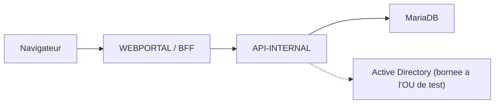

# Kermaria Client Platform

Plateforme technique de l'espace client **Zachary HOUNSA-HOUNKPA EI** pour
`clients.zacharyhounsa.ovh`.

Ce depot reste separe du site vitrine Astro et conserve une architecture
obligatoire :

```text
browser -> WEBPORTAL / BFF -> API-INTERNAL -> MariaDB
```

`WEBPORTAL` ne doit jamais acceder directement a MariaDB.

## Etat courant V0.27 + V0.29 Stripe + V0.30 partiel + V0.32/V0.33 packs + V0.35/V0.36 checkout + V0.37 downloads + V0.24 infra debout

Le depot couvre aujourd'hui les jalons V0.9 a V0.31 + V0.35 + V0.36 (voir
[`docs/ROADMAP.md`](docs/ROADMAP.md)). L'integration BPCE de la V0.20
emet de vraies factures fiscales (mode `live` desactive par defaut, en
phase de tests), la V0.21 ouvre les canaux de paiement client one-shot,
la V0.22 ajoute les abonnements PayPal recurrents, les V0.23/V0.23.1
harmonisent l'UX cote client et admin, la V0.27 ajoute le site
vitrine public, la V0.29 branche Stripe comme rail parallele a PayPal,
la V0.30 partiel livre le garde-fou `EMAIL_LIVE_ALLOWLIST` pour
tester les envois SMTP reels, et la V0.35 ajoute un **panier a la carte**
self-service (regroupe N options one-shot en une commande unique reglee via
Stripe / PayPal / virement, cf.
[`docs/V0.35_CART_ALACARTE.md`](docs/V0.35_CART_ALACARTE.md)).

V0.32 (2026-07-09) remplace l'affichage public des briques techniques par
4 **packs grand public** relies au catalogue facturable existant, avec
variantes 1/6/12 mois, paiement mensualise ou comptant selon le cas,
snapshot au signup et compatibilite de provisionnement via
`external_reference`, cf.
[`docs/V0.32_PUBLIC_PACKS.md`](docs/V0.32_PUBLIC_PACKS.md). V0.33 ajoute
la couche de **contenus administrables** pour les CGV, les mentions
legales, la page a propos et les fiches detaillees des packs publics, cf.
[`docs/V0.33_CONTENUS_ADMINISTRABLES.md`](docs/V0.33_CONTENUS_ADMINISTRABLES.md).

V0.36 (2026-07-09) complete ce socle avec un **panier unifie** qui
previsualise achats ponctuels et abonnements recurrents sur `/souscrire`,
dans un drawer de header et sur `/panier`, tout en conservant deux tunnels
de confirmation distincts. Les abonnements peuvent maintenant etre
**factures** (`rail=billing`) : creation locale en `pending_payment`,
facture initiale groupee, choix explicite Stripe / PayPal / virement sur la
page document, activation automatique au paiement et renouvellement facture
via worker, cf.
[`docs/V0.36_PANIER_UNIFIE_ABONNEMENTS_FACTURES.md`](docs/V0.36_PANIER_UNIFIE_ABONNEMENTS_FACTURES.md).

V0.37 (2026-07-13) ajoute un **centre de telechargements client securise**
sur `/downloads`, avec categories repliables, cartes homogenes cote client,
CRUD admin sur `/admin/downloads`, regles de visibilite alignees sur les
packs/offres/services actifs et stockage prive des binaires cote
`API-INTERNAL` via `DOWNLOAD_STORAGE_ROOT`, cf.
[`docs/V0.37_CENTRE_TELECHARGEMENTS_CLIENT.md`](docs/V0.37_CENTRE_TELECHARGEMENTS_CLIENT.md).

V0.35.1 (2026-07-09) : correctif transversal des horodatages — plus aucun
`NOW()`/`CURRENT_TIMESTAMP` (heure locale serveur) en base, serialisation
API systematiquement en ISO 8601 `Z`, affichage force Europe/Paris ;
garde-fou statique dans `npm run test:timezone`, cf.
[`docs/V0.35.1_TIMEZONE_UTC_FIX.md`](docs/V0.35.1_TIMEZONE_UTC_FIX.md).

V0.24 : cadrage redige, **infra staging debout sur KERMARIA-SRV-01/02/07
depuis 2026-07-03**. Deploiement natif Windows Server 2022 sans VM
documente dans [`docs/DEPLOYMENT_WINDOWS.md`](docs/DEPLOYMENT_WINDOWS.md).
Split IIS front vitrine/backoffice avec host headers scoped, config
runtime en fichier JSON externe (aucune variable Machine), bootstrap
du 1er admin via `--seed-admin` (voir "Bootstrap du premier admin"
plus bas). Reste a executer : recette Brique 1, audit securite
Brique 2, redaction procedure prod Brique 3.

Acquis V0.27 (site vitrine public,
[`docs/V0.27_PUBLIC_VITRINE.md`](docs/V0.27_PUBLIC_VITRINE.md)) :

- bascule `PublicShell` / `AppShell` selon la route, pilotee par une
  `proxy.ts` (convention Next 16) qui injecte `x-pathname` ;
- racine `/` branche selon la session : client -> `/dashboard`,
  admin -> `/admin`, anonyme + `PUBLIC_VITRINE_ENABLED=false` ->
  `/login`, anonyme + flag actif -> landing vitrine ;
- landing au ton calque sur [zacharyhounsa.ovh](https://zacharyhounsa.ovh/) :
  hero "Informatique claire et utile", section Methode (3 etapes),
  Services (6 prestations), Pour qui (particuliers / associations /
  petites structures), CTA finale ;
- portfolio integre en statique : copie integrale du portfolio Astro
  sous `apps/webportal/public/portfolio/` (21 fichiers, source de
  verite reste sur `zacharyhounsa.ovh/portfolio/` via canonical), lien
  dans la nav header ;
- pages publiques Next `/`, `/offres`, `/a-propos`, `/contact`,
  `/mentions-legales`, `/politique-confidentialite`, `/cgv` (contenu
  redactionnel des pages legales et `/a-propos` finalise avant
  V1.0 RC) ;
- `/offres` reutilise le catalogue V0.15 en lecture seule
  (`/internal/portal/catalog` rendu anonyme cote api-internal, toujours
  protege par `X-Service-Auth`), tri `displayOrder`, filtre des offres
  `monthly` sans plan PayPal pour le mode actif, cache 5 min ;
- `/contact` : POST `/api/contact` avec rate limit (5 req/5 min par
  IP), forward vers `/internal/public/contact-message`, template email
  `contact_form` (recipient `CONTACT_FORM_RECIPIENT`, respect
  `EMAIL_INTEGRATION_MODE`), lien de retour en haut de page ;
- SEO : `sitemap.ts` dynamique (les 7 pages Next, portfolio non
  inclus), `robots.ts` etendu, JSON-LD `Organization` sur `/`,
  `metadataBase` + `openGraph` par defaut ;
- conformite confidentialite : aucun analytics, aucun pixel tiers,
  aucune banniere cookies. Page politique de confidentialite enumere
  les seuls cookies emis (session, CSRF, hCaptcha si active) ;
- flag `PUBLIC_VITRINE_ENABLED=false` par defaut, bascule a `true` en
  preprod apres recette.

Acquis V0.23.2 (patch harmonisation horodatages,
[`docs/V0.23.2_TIMEZONE_PATCH.md`](docs/V0.23.2_TIMEZONE_PATCH.md)) :

- `formatDate` / `formatDateTime` cote front forcent
  `timeZone: "Europe/Paris"` (constante `DISPLAY_TIME_ZONE`), bascule
  DST automatique ete/hiver via IANA ;
- helper C# partage `KermariaTimeZone` (Infrastructure/) avec fallback
  Windows `Romance Standard Time`, utilise pour la date fiscale envoyee
  a BPCE (`InvoiceIssuingService`) et les timestamps du logger fichier ;
- console log `AddJsonConsole` : `UseUtcTimestamp = false` + format
  `yyyy-MM-ddTHH:mm:ss.fffzzz` (offset ISO 8601 explicite) ;
- MariaDB reste en UTC et les payloads JSON `Z` inchanges — seule la
  chaine d'affichage est convertie ;
- non-regression : `npm run test:timezone` couvre l'ete, l'hiver et la
  bascule 2026-03-29.

Acquis V0.23 et V0.23.1 (harmonisation UX,
[`docs/V0.23_HARMONISATION_UX.md`](docs/V0.23_HARMONISATION_UX.md)) :

- navigation laterale gauche unifiee (sidebar) cote portail client et
  cote administration, exposant **toutes** les pages disponibles ;
- dashboard admin nettoye, flux d'activite publique extrait dans
  `/admin/activity`, journal d'audit a `/admin/audit-logs` ;
- catalogue admin refondu : liste tabulaire `/admin/catalog`, fiche
  d'edition `/admin/catalog/[id]`, creation `/admin/catalog/new` ;
- bouton Desactiver/Reactiver l'offre (soft-delete via PATCH
  `status: inactive`, pas d'API DELETE) ;
- page support cote client en zone centrale (formulaire en haut,
  liste empilee dessous) ;
- harmonisation visuelle paiements/abonnements (meme bandeau
  metriques + bloc filtres) ;
- elargissement global a 1480 px, bouton "Consulter" toujours visible
  sans scroll horizontal, filtres harmonises (label au-dessus,
  arrondis), libelles AD en francais sur la fiche client.

Acquis V0.22 et V0.22.1 (abonnements PayPal,
[`docs/V0.22_SUBSCRIPTIONS.md`](docs/V0.22_SUBSCRIPTIONS.md)) :

- facturation automatique mensuelle via PayPal Subscriptions API,
  flow client `/services` -> "Souscrire" -> approbation PayPal ->
  webhook `ACTIVATED` -> `PAYMENT.SALE.COMPLETED` ;
- webhook `POST /api/webhooks/paypal` avec verification de signature
  PayPal (skippable en sandbox local) et idempotence par `event_id` ;
- creation automatique du document `informational_invoice` + facture
  BPCE mock + email `payment_confirmed` a chaque paiement recurrent ;
- admin `/admin/subscriptions` (filtre statut/client + MRR HT estime),
  bouton "Annuler" (cancel PayPal + audit) sur `/admin/subscriptions/{id}` ;
- creation automatique des Plans PayPal depuis l'admin (V0.22.1) :
  `paypal_plan_id_sandbox` + `paypal_plan_id_live`, bouton "Creer le
  plan PayPal" sur la fiche offre, prix fige une fois un plan cree ;
- mode `PAYPAL_MODE=live` reste interdit avant V1.0 beta 1.

Acquis V0.26 (creation de compte self-service, livre le 2026-07-02,
`SIGNUP_ENABLED=false` par defaut,
[`docs/V0.26_SELF_SERVICE_SIGNUP.md`](docs/V0.26_SELF_SERVICE_SIGNUP.md)) :

- formulaire public `/signup` avec honeypot + timing anti-bot et
  **hCaptcha** verifie cote serveur (`siteverify`) avant insertion ;
- verification e-mail par token aleatoire 32 octets **stocke en hash
  SHA-256**, TTL 24h, one-shot ; table `signup_pending`
  (migration `020_signup_pending.sql`) ;
- workflow admin `/admin/signups` (liste/detail/approuver/refuser) ;
  l'approbation cree customer + portal_user (statut `active`, sans mot de
  passe), **aucune creation AD automatique** ;
- activation par **lien de definition de mot de passe** (`/set-password`,
  token hash SHA-256 one-shot TTL 24h) : aucun mot de passe en clair ;
- e-mails `signup_verification` / `account_approved` / `account_rejected`
  (mode courant `disabled`/`mock`/`live`), audit a chaque etape ;
- tests contrat `npm run test:signup`. Ouverture des inscriptions
  reservee au test interne tant que `EMAIL_INTEGRATION_MODE=mock`.

Acquis V0.29 (Stripe, rail de paiement parallele a PayPal,
[`docs/V0.29_STRIPE_PAYMENTS.md`](docs/V0.29_STRIPE_PAYMENTS.md)) :

- one-shot via Stripe Checkout Sessions (`mode=payment`) et webhook
  `payment_intent.succeeded` ;
- abonnements via Checkout Sessions `mode=subscription` +
  `stripe_price_id_test`/`stripe_price_id_live` sur `commercial_offers`,
  webhook `invoice.paid` (active + facture chaque echeance) et
  `customer.subscription.deleted` (annulation) ;
- webhook `POST /api/webhooks/stripe`, verification de signature HMAC
  locale (pas d'appel reseau, contrairement a PayPal), idempotence
  `stripe_webhook_events.event_id` ;
- table `subscriptions` generalisee par `rail` (`paypal`/`stripe`) plutot
  que dupliquee, colonne `payment_method` sur `commercial_documents`
  (ferme une lacune V0.21 : le rail de paiement n'etait jamais persiste) ;
- admin : colonne "Rail" sur `/admin/payments`, badge "Rail" sur
  `/admin/subscriptions`, bouton "Creer le prix Stripe" sur la fiche
  offre (miroir V0.22.1) ;
- portail client : radio de rail sur le bouton "Payer" et "Souscrire"
  quand PayPal et Stripe sont actifs, defaut Stripe ;
- mode `STRIPE_MODE=live` interdit avant V1.0 beta 1, **garde-fou code en
  dur** dans `RuntimeConfigurationValidator` (contrairement a PayPal ou
  ce n'est qu'une discipline de process).

Acquis V0.20 et V0.21 (facturation et paiements one-shot) :

- facturation reelle via l'API BPCE Banque Populaire avec numerotation
  fiscale, validation immuable et PDF cache localement
  ([`docs/V0.20_BPCE_INVOICING.md`](docs/V0.20_BPCE_INVOICING.md)) ;
- modes `BPCE_INTEGRATION_MODE` : `disabled` (defaut) / `mock` / `live` ;
- import de 17 articles catalogue avec `external_reference` et taux TVA
  indicatif (V0.20.1) ;
- section `Reglement` cote portail client avec IBAN/BIC ;
- paiement carte / PayPal one-shot via PayPal Orders API v2
  (`intent: CAPTURE`), modes `PAYPAL_MODE=sandbox|live` ;
- telechargement PDF cote portail client (V0.21), vue admin
  `/admin/payments` (totaux a regler/regle + filtre statut) ;
- canal e-mail transactionnel `EMAIL_INTEGRATION_MODE` =
  `disabled` (defaut) / `mock` / `live`, 3 templates texte
  (invoice_issued, payment_reminder, payment_confirmed),
  journal `/admin/email-log`
  ([`docs/V0.21_PAYMENT_CHANNELS.md`](docs/V0.21_PAYMENT_CHANNELS.md)).

Acquis V0.25 (finalisation Active Directory, livre et valide en
recette utilisateur 2026-06-30 sur AD reel `home.bzh`,
[`docs/V0.25_AD_FINALISATION.md`](docs/V0.25_AD_FINALISATION.md)) :

- brique 3 : procedure de sortie d'OU vers production
  ([`docs/AD_PRODUCTION_MIGRATION.md`](docs/AD_PRODUCTION_MIGRATION.md))
  redigee, executable en V1.0 RC seulement ;
- brique 2 : provisioning AD etendu dans `OU=TEST_SITE_WEB` (lecture
  groupes effectifs directs+transitifs, rename user
  CN/sAM/displayName/UPN, move user Users<->Disabled meme client OU
  cross-client). UI : 3 nouvelles SectionCards dans la fiche client ;
- brique 1 : changement de mot de passe AD client depuis `/password`,
  derriere flag `AD_PASSWORD_CHANGE_ENABLED=true` (defaut `false`),
  policy AD du domaine = seule source de verite (aucune regle
  longueur/complexite cote API), rate limit 3 echecs / 15 min avec
  blocage 15 min, audit `ad.password_change.*`, aucun mot de passe en
  log ni en cache.

Acquis V0.18 et V0.19 (toujours actifs) :

- modes AD `disabled`, `mock`, `read_only` et `controlled_write` bornes a
  l'OU de test `OU=TEST_SITE_WEB,DC=home,DC=bzh` ;
- mutations BFF admin sensibles protegees par un jeton CSRF cote serveur ;
- `X-Service-Auth` exige sur `/internal/*` dans tout environnement non
  `Development` ;
- validateur d'entrees AD strict cote `API-INTERNAL`.

Le mode `live` BPCE/PayPal/EMAIL/Stripe n'est jamais active sans
validation explicite (V1.0 beta 1, R740xd).

Le projet reste en **phase de tests** sur SRV-01 et SRV-02 tant que la
cible R740xd n'est pas livree : aucun client reel, aucun envoi e-mail
externe a un destinataire reel hors liste blanche, aucun prelevement
recurrent active.

A venir avant la bascule hardware (tous faisables sans R740xd, ajoutes
au 2026-06-30) :

- V0.24 stabilisation testable SRV-01/02 ;
- V0.28 catalogue packs et offres groupees ;
- V0.30 premier test SMTP reel controle (brique allowlist livree le
  2026-07-02 — [`docs/V0.30_EMAIL_LIVE_TEST.md`](docs/V0.30_EMAIL_LIVE_TEST.md) —
  reste a livrer : statuts `email_messages` etendus, sous-domaine
  emetteur dedie, SPF/DKIM/DMARC documentes, recette guidee) ;
- V0.31 sortie effective de `OU=TEST_SITE_WEB` (procedure V0.25
  brique 3 executee, levee du `RequiredTestOuRoot` hardcode) ;

Voir [`docs/ROADMAP.md`](docs/ROADMAP.md) pour le detail.

## Architecture



Rappels importants :

- le navigateur parle uniquement a `WEBPORTAL` ;
- `INTERNAL_API_URL` et `SERVICE_AUTH_TOKEN` restent server-only ;
- les sessions sont portées par un cookie `HttpOnly` ;
- aucun token de session ne doit etre stocke en `localStorage` ou
  `sessionStorage`.

## Structure

```text
apps/webportal/                 Portail Next.js et routes BFF
apps/api-internal/              API ASP.NET Core privee
packages/shared/                Contrats TypeScript non sensibles
tests/api-internal/             Smoke tests HTTP
scripts/                        Validation globale et garde-fous
docs/                           Architecture, securite et exploitation
```

## Prerequis

- Node.js 24 LTS ou compatible ;
- npm ;
- SDK .NET 10 ;
- MariaDB uniquement pour les tests persistants opt-in.

Ne pas utiliser `npm audit fix --force`.

## Configuration

Copier uniquement les noms utiles de `.env.example` vers des variables
d'environnement locales. Ne jamais stocker de vrai secret dans un fichier
suivi.

Variables critiques WEBPORTAL :

- `INTERNAL_API_URL`
- `SERVICE_AUTH_TOKEN`
- `SESSION_COOKIE_NAME`
- `SESSION_COOKIE_SECURE`
- `SESSION_COOKIE_SAME_SITE`

Variables critiques API-INTERNAL :

- `ASPNETCORE_ENVIRONMENT`
- `DOTNET_ENVIRONMENT`
- `SQL_PROVIDER`, `SQL_HOST`, `SQL_PORT`, `SQL_DATABASE`, `SQL_USERNAME`,
  `SQL_PASSWORD`
- `SERVICE_AUTH_TOKEN`
- `SESSION_DURATION_MINUTES`
- `LOGIN_MAX_FAILURES`
- `LOGIN_LOCKOUT_MINUTES`
- `AD_INTEGRATION_MODE=disabled|mock|read_only|controlled_write`
- `AD_DOMAIN`
- `AD_CLIENTS_OU_DN`
- `AD_SERVICE_ACCOUNT_USERNAME`
- `AD_SERVICE_ACCOUNT_PASSWORD`
- `AD_PASSWORD_CHANGE_ENABLED=true|false` (defaut `false`, V0.25 brique 1)
- `AD_PASSWORD_RATE_LIMIT_PER_15MIN=3` (defaut, V0.25 brique 1)
- `BPCE_INTEGRATION_MODE=disabled|mock|live`
- `BPCE_BASE_URL`, `BPCE_REFRESH_TOKEN`, `BPCE_SENDER_ID`
- `LOG_FILE_DIRECTORY`, `LOG_FILE_LEVEL`, `LOG_FILE_RETENTION_DAYS`
  (rotation quotidienne, voir `apps/api-internal/Infrastructure/FileLoggerProvider.cs`)

Variables paiement et reglement (V0.21 / V0.22) :

- `PAYPAL_MODE=sandbox|live`
- `PAYPAL_CLIENT_ID`
- `PAYPAL_CLIENT_SECRET`
- `PAYPAL_WEBHOOK_ID` (V0.22, requis pour la verification webhook)
- `PAYPAL_WEBHOOK_VERIFY=true|false` (V0.22, skippable en sandbox local
  uniquement)
- `BILLING_IBAN`, `BILLING_BIC`, `BILLING_TRANSFER_LABEL`
- `BILLING_PAYPAL_URL` (fallback PayPal.me)

Variables Stripe (V0.29, rail parallele a PayPal) :

- `STRIPE_MODE=disabled|test|live` (defaut `disabled`)
- `STRIPE_SECRET_KEY`
- `STRIPE_PUBLISHABLE_KEY`
- `STRIPE_WEBHOOK_SECRET` (requis pour la verification de signature)
- `STRIPE_WEBHOOK_VERIFY=true|false` (defaut `true`, `false` autorise en
  debug local uniquement)

Variables e-mail transactionnel (V0.21) :

- `EMAIL_INTEGRATION_MODE=disabled|mock|live` (defaut `disabled`)
- `SMTP_HOST`, `SMTP_PORT` (defaut 587)
- `SMTP_USE_STARTTLS=true|false` (defaut `true`)
- `SMTP_USERNAME`, `SMTP_PASSWORD`
- `SMTP_FROM_ADDRESS`, `SMTP_FROM_DISPLAY_NAME`
- `SMTP_TIMEOUT_MS`

## Developpement local

API-INTERNAL :

```powershell
$env:ASPNETCORE_ENVIRONMENT="Development"
$env:DOTNET_ENVIRONMENT="Development"
$env:AD_INTEGRATION_MODE="disabled"
dotnet run --project apps/api-internal/Kermaria.ApiInternal.csproj --urls http://localhost:5000
```

WEBPORTAL :

```powershell
$env:INTERNAL_API_URL="http://localhost:5000"
$env:ALLOW_LOCAL_INTERNAL_API_URL="true"
npm run dev:web
```

Sous PowerShell restrictif, utiliser `npm.cmd`.

### Bootstrap du premier admin (staging / prod)

En dehors du seed demo (Development uniquement), le premier compte
`internal_admin` d'un deploiement se cree en prompt interactif :

```powershell
# Sur la machine cible, avec les SQL_* pointant sur la base kermaria
$env:SQL_USERNAME = "kermaria_migrator"   # ou celui qui a les DML droits
$env:SQL_PASSWORD = "<mdp>"
C:\apps\api-internal\Kermaria.ApiInternal.exe --environment Staging --seed-admin
```

Le prompt masque le mot de passe (jamais loggue, jamais visible
dans `Get-Process` ou dans NSSM stdout), verifie qu'il fait au
moins 12 caracteres, refuse un doublon email. Si aucun customer
n'existe encore, un sentinel `INTERNAL` est cree pour satisfaire
la FK `portal_users.customer_id`.

L'utilisateur peut ensuite se connecter au portail via
`/login` et approuver les signups V0.26 recus via
`/admin/signups`.

## Verification

Verifications locales rapides (typecheck + lint webportal) :

```powershell
npm run typecheck:webportal
npm run lint:webportal
```

Validation globale (typecheck + lint + build + tests contrats) :

```powershell
npm run validate
```

Validation staging :

```powershell
npm run validate:staging
```

Validation preproduction :

```powershell
npm run validate:preprod
```

Validation MariaDB opt-in :

```powershell
npm run validate:mariadb
```

Health checks :

```powershell
npm run check:health
```

Tests contrat ciblés (sans MariaDB requise) :

```powershell
npm run test:bpce            # facturation BPCE V0.20
npm run test:payments        # canaux paiement V0.21
npm run test:subscriptions   # abonnements PayPal V0.22
npm run test:payments-stripe # rail Stripe V0.29
npm run test:signup          # inscription self-service V0.26
npm run test:email-live      # allowlist envoi live V0.30 partiel
npm run test:activity        # flux activite admin
npm run test:ad-security     # garde-fous AD
```

## Contraintes permanentes

- ne pas changer l'architecture ;
- ne pas connecter `WEBPORTAL` directement a MariaDB ;
- ne pas activer l'AD hors de l'OU de test validee ;
- ne pas exposer de hard delete AD ;
- ne pas activer `BPCE_INTEGRATION_MODE=live`, `PAYPAL_MODE=live` ou
  `EMAIL_INTEGRATION_MODE=live` sans validation explicite (cible
  R740xd, V1.0 beta 1) ;
- ne pas ajouter de prelevement SEPA hors PayPal, d'e-mail automatique,
  de SMS, push, WebSocket ou provisioning declenche par un encaissement ;
- ne pas logger tokens, cookies, mots de passe, chaines de connexion,
  secrets BPCE (`BPCE_REFRESH_TOKEN`), credentials PayPal ni montants de
  facture complets.

## Documentation

- [Architecture](docs/ARCHITECTURE.md)
- [API contract](docs/API_CONTRACT.md)
- [Data model](docs/DATA_MODEL.md)
- [Security](docs/SECURITY.md)
- [Deployment](docs/DEPLOYMENT.md)
- [Deploiement Windows Server 2022 (SRV-01/02/07)](docs/DEPLOYMENT_WINDOWS.md)
- [Procedure de mise en production (R740xd)](docs/PRODUCTION_DEPLOYMENT.md)
- [Operations](docs/OPERATIONS.md)
- [Backup and restore](docs/BACKUP_RESTORE.md)
- [Roadmap](docs/ROADMAP.md)
- [Implementation map - current state](docs/IMPLEMENTATION_MAP_CURRENT.md)
- [V0.24 Stabilisation (cadrage)](docs/V0.24_STABILISATION.md)
- [V0.24 Suivi execution briques](docs/V0.24_SUIVI.md)
- [Guide client — payer une facture](docs/GUIDE_CLIENT_PAIEMENT.md)
- [Guide administrateur — portail interne](docs/GUIDE_ADMIN.md)
- [Guide utilisateur — inscription self-service V0.26](docs/V0.26_USER_GUIDE_SIGNUP.md)
- [Rotation des secrets](docs/SECRET_ROTATION.md)
- [BPCE invoicing V0.20](docs/V0.20_BPCE_INVOICING.md)
- [Payment channels V0.21](docs/V0.21_PAYMENT_CHANNELS.md)
- [Subscriptions V0.22](docs/V0.22_SUBSCRIPTIONS.md)
- [Harmonisation UX V0.23](docs/V0.23_HARMONISATION_UX.md)
- [Patch horodatages V0.23.2](docs/V0.23.2_TIMEZONE_PATCH.md)
- [Cadrage AD finalisation V0.25](docs/V0.25_AD_FINALISATION.md)
- [Procedure sortie OU AD prod (V0.25 brique 3)](docs/AD_PRODUCTION_MIGRATION.md)
- [Self-service signup V0.26](docs/V0.26_SELF_SERVICE_SIGNUP.md)
- [Guide utilisateur signup V0.26](docs/V0.26_USER_GUIDE_SIGNUP.md)
- [Test envoi e-mail live V0.30 (partiel : allowlist)](docs/V0.30_EMAIL_LIVE_TEST.md)
- [Cadrage site vitrine public V0.27](docs/V0.27_PUBLIC_VITRINE.md)
- [Packs grand public V0.32](docs/V0.32_PUBLIC_PACKS.md)
- [Contenus administrables V0.33](docs/V0.33_CONTENUS_ADMINISTRABLES.md)
- [Panier one-shot V0.35](docs/V0.35_CART_ALACARTE.md)
- [Panier unifie et abonnements factures V0.36](docs/V0.36_PANIER_UNIFIE_ABONNEMENTS_FACTURES.md)
- [Centre de telechargements client securise V0.37](docs/V0.37_CENTRE_TELECHARGEMENTS_CLIENT.md)
- [Correctif UTC V0.35.1](docs/V0.35.1_TIMEZONE_UTC_FIX.md)
- [Active Directory security hardening V0.19](docs/V0.19_AD_SECURITY_HARDENING.md)
- [Active Directory controlled write V0.18](docs/V0.18_ACTIVE_DIRECTORY_CONTROLLED_WRITE.md)
- [Preproduction technique V0.16](docs/V0.16_PREPRODUCTION_TECHNIQUE.md)
- [Recette preproduction V0.17](docs/V0.17_RECETTE_PREPRODUCTION.md)
- [Secret rotation](docs/SECRET_ROTATION.md)
- [Permanent rules](AGENTS.md)
