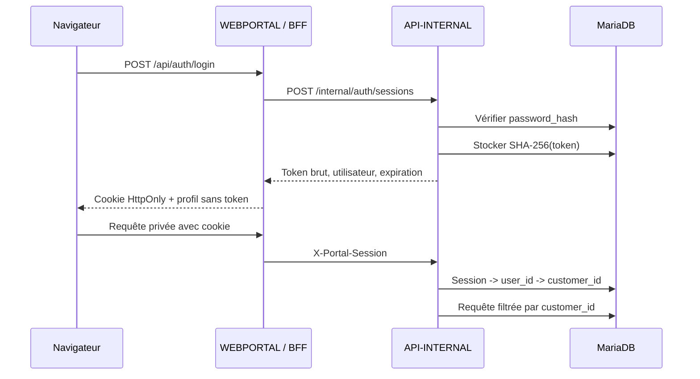
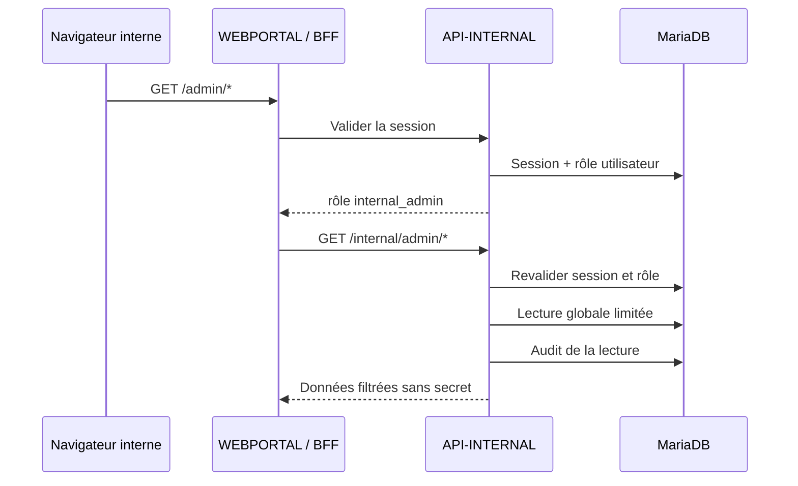
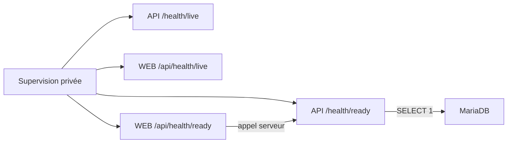

# Architecture

## Vue d'ensemble

La plateforme sépare strictement l'exposition publique des opérations internes
sensibles.

```text
Internet
  -> Cloudflare / reverse proxy HTTPS
  -> WEBPORTAL
  -> réseau privé
  -> API-INTERNAL
  -> SQL existant / AD / NAS / RDS / VPN / facturation
```

L'architecture comporte au maximum deux VM applicatives. Le serveur SQL existe
déjà et ne fait pas partie des VM à créer.

## WEBPORTAL

`WEBPORTAL` est déployée sur Ubuntu Server LTS. Elle héberge :

- l'interface web destinée aux clients ;
- le backend public de type Backend for Frontend (BFF) ;
- les routes BFF d'authentification et le cookie de session `HttpOnly` ;
- les routes BFF d'administration et leurs mutations bornees ;
- les contrôles de validation, de rate limiting et de protection web ;
- les routes publiques du contrat d'API.
- les health checks publics du portail, sans détail interne.

`WEBPORTAL` est le seul composant applicatif accessible depuis Internet, et
uniquement au travers de Cloudflare ou du reverse proxy HTTPS. Il ne possède
aucun accès direct à Active Directory, au NAS, à RDS, au VPN, au serveur SQL ou
aux outils de facturation internes.

## API-INTERNAL

`API-INTERNAL` est déployée sur Windows Server Core 2022 ou 2025. Elle héberge :

- l'API privée appelée uniquement par `WEBPORTAL` ou par des processus internes
  explicitement autorisés ;
- les règles d'autorisation des opérations sensibles ;
- les adaptateurs futurs vers SQL, AD, NAS, RDS, VPN et facturation ;
- les logs d'audit des opérations sensibles ;
- la vérification des mots de passe et la création/révocation des sessions ;
- la résolution de `user_id` et `customer_id` avant tout accès métier ;
- le contrôle des rôles `client_user` et `internal_admin` ;
- les lectures globales admin limitées et auditables ;
- la validation stricte de configuration et la readiness MariaDB ;
- les mocks des integrations tant que les systemes reels ne sont pas actives ;
- l'unique point d'acces autorise a MariaDB et Active Directory.

Elle n'expose aucune interface directement sur Internet. Son pare-feu n'accepte
les appels applicatifs que depuis les sources privées autorisées, en priorité
`WEBPORTAL`.

## Flux d'authentification V0.9



Le navigateur ne reçoit jamais le token dans un corps JSON et ne peut pas lire
le cookie depuis JavaScript. Le BFF ne choisit pas le client : API-INTERNAL le
résout depuis la session persistée.

Après plusieurs échecs consécutifs, API-INTERNAL enregistre un verrouillage
temporaire du compte. Un succès remet le compteur à zéro. La session courante
peut révoquer les autres sessions du même utilisateur sans exposer leurs
tokens.

## Flux d'administration V0.9



Le préfixe UI retenu est `/admin`. Il distingue clairement l'interface humaine
des endpoints privés `/internal/*`. Les pages et endpoints admin declenchent
uniquement des actions bornees via le BFF, avec controle de role, validation
des identifiants et CSRF sur les mutations sensibles. Un utilisateur client est
refusé côté BFF et côté API-INTERNAL. Un administrateur interne n'utilise pas
les vues client afin d'éviter toute confusion ou impersonation implicite.

## Flux réseau autorisés

| Source | Destination | Usage | Conditions |
|---|---|---|---|
| Client Internet | Cloudflare / reverse proxy | Accès HTTPS au portail | TLS, filtrage, protections anti-abus |
| Cloudflare / reverse proxy | `WEBPORTAL` | Transmission des requêtes du portail | HTTPS, origine restreinte si possible |
| `WEBPORTAL` | `API-INTERNAL` | Appels métier et sensibles | Réseau privé, TLS, `X-Service-Auth` en tout environnement non `Development` |
| `API-INTERNAL` | SQL existant | Lecture et écriture applicatives | Compte SQL dédié et droits minimaux |
| `API-INTERNAL` | AD | Actions AD futures contrôlées | Réseau privé, compte de service limité à l'OU Clients |
| `API-INTERNAL` | NAS, RDS, VPN, facturation | Intégrations futures | Flux explicites, authentifiés et minimaux |
| VM applicatives | Supervision et collecte de logs | Exploitation | Canaux sécurisés, accès administrateur restreint |

Les ports, protocoles précis et listes d'adresses seront documentés dans la
phase de déploiement lorsque l'infrastructure cible sera connue.

## Flux interdits

- Internet vers `API-INTERNAL`.
- Navigateur client vers `API-INTERNAL`.
- Navigateur client ou `WEBPORTAL` vers Active Directory.
- `WEBPORTAL` vers SQL, NAS, RDS, VPN ou la facturation interne.
- Active Directory vers Internet au bénéfice de l'application.
- Usage d'un compte `Domain Admin` par un composant de la plateforme.
- Accès réseau implicite ou large entre les zones publique et interne.

Tout flux non explicitement autorisé doit être refusé par défaut.

## Intégration avec le SQL existant

La base de données reste hébergée sur le serveur SQL existant. Seule
`API-INTERNAL` s'y connecte avec une identité technique dédiée :

- aucun compte administrateur de base de données ;
- droits limités aux schémas, tables et opérations nécessaires ;
- chaîne de connexion fournie par variable d'environnement ou gestionnaire de
  secrets ;
- connexions chiffrées lorsque le moteur et l'infrastructure le permettent ;
- migrations versionnées et sauvegardes coordonnées avec l'exploitation ;
- aucune dépendance à un moteur SQL précis dans le modèle métier initial.

Le portail obtient ses données par l'API privée et ne connaît jamais les
coordonnées de connexion SQL.

En V0.9, toutes les lectures et écritures portail sont filtrées par le
`customer_id` de la session. Les demandes support vérifient en plus que le
service ciblé appartient à ce même client.

## Exploitation V0.9



La liveness répond tant que le processus fonctionne. La readiness vérifie la
configuration et les dépendances nécessaires avant mise en trafic. Elle ne
retourne aucune coordonnée SQL, URL interne ou valeur secrète.

Les configurations Production sont refusées si MariaDB, le token interservice
ou les paramètres de cookie ne respectent pas les exigences minimales. Le
fallback mock reste uniquement un comportement Development explicite.

Les sauvegardes et restaurations sont des opérations MariaDB externes au
runtime applicatif. Elles ne sont ni déclenchées par le portail ni stockées
dans le dépôt.

## Intégrations futures

### Active Directory

Les actions AD sont implémentees exclusivement dans `API-INTERNAL`. Le compte
de service dedie est borne a l'OU de test
`OU=TEST_SITE_WEB,DC=home,DC=bzh` et aux operations strictement requises par
la V0.18. Aucun hard delete AD, reset de mot de passe ou extension vers une OU
de production n'est expose.

### NAS

L'intégration pourra gérer les métadonnées ou demandes d'accès aux espaces
clients. Les permissions réelles devront être traduites en opérations
explicites, autorisées et auditées par `API-INTERNAL`.

### RDS

L'intégration pourra exposer au portail l'état ou les droits d'un service RDS,
sans fournir d'accès d'administration au portail. Toute modification passera
par une opération interne contrôlée.

### VPN

L'intégration pourra présenter l'état d'un abonnement ou déclencher un
workflow de provisioning. Les clés, profils et secrets VPN ne devront pas
transiter inutilement ni être stockés dans les logs.

### Facturation

`API-INTERNAL` adaptera le système de facturation existant au modèle commun des
factures. Le portail recevra uniquement les données du client authentifié et
des liens ou documents à durée de vie contrôlée si nécessaire.

## Principes d'évolution

- Commencer avec des adaptateurs mock avant toute connexion à l'infrastructure.
- Conserver les contrats métier indépendants des fournisseurs techniques.
- Refuser par défaut les actions non prévues.
- Rendre chaque opération sensible authentifiée, autorisée, traçable et
  idempotente lorsque cela est pertinent.
