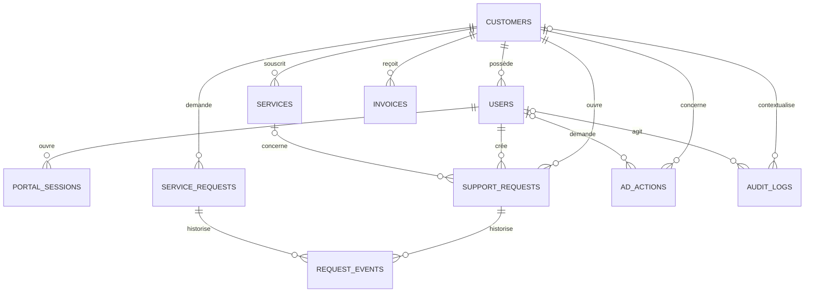

# Modèle de données initial

## Principes

Le modèle reste conceptuel et indépendant d'un moteur SQL. Il devra pouvoir
être adapté à SQL Server, PostgreSQL ou MariaDB sans modifier les règles métier.

- Utiliser des clés internes opaques et stables.
- Utiliser des clés étrangères et contraintes d'unicité explicites.
- Stocker les dates en UTC.
- Représenter les montants par une valeur décimale et un code devise, jamais
  par un nombre flottant.
- Éviter les types, fonctions et stratégies d'auto-incrément spécifiques à un
  fournisseur dans le domaine métier.
- Définir les tailles maximales des textes lors de l'implémentation.
- Ne jamais stocker de mot de passe AD, jeton de session ou secret applicatif
  dans ces tables.

Les types ci-dessous sont logiques : `identifier`, `text`, `timestamp`,
`decimal`, `boolean` et `json` devront être traduits de manière portable.

## customers

Représente une organisation ou un client contractuel.

| Champ | Type logique | Description |
|---|---|---|
| `id` | identifier | Clé interne |
| `external_reference` | text, nullable | Référence dans un système existant |
| `display_name` | text | Nom affiché |
| `status` | text | État métier contrôlé |
| `billing_email` | text, nullable | Contact de facturation |
| `created_at` | timestamp | Date de création |
| `updated_at` | timestamp | Dernière modification |

Contraintes : référence externe unique lorsqu'elle est renseignée.

## users

Représente l'identité applicative d'un utilisateur du portail.

| Champ | Type logique | Description |
|---|---|---|
| `id` | identifier | Clé interne |
| `customer_id` | identifier | Client propriétaire |
| `identity_provider_subject` | text | Identifiant opaque conservé pour une évolution future |
| `email` | text | Adresse normalisée pour le contact |
| `password_hash` | text, nullable | Hash PBKDF2 du mot de passe local |
| `display_name` | text | Nom affiché |
| `status` | text | État métier contrôlé |
| `role` | text | `client_user` ou `internal_admin` |
| `last_login_at` | timestamp, nullable | Dernière connexion réussie |
| `failed_login_count` | integer | Échecs consécutifs dans la fenêtre active |
| `last_failed_login_at` | timestamp, nullable | Dernier échec de connexion |
| `locked_until` | timestamp, nullable | Fin du verrouillage temporaire |
| `created_at` | timestamp | Date de création |
| `updated_at` | timestamp | Dernière modification |

Contraintes : sujet du fournisseur d'identité unique. L'adresse e-mail ne doit
pas être utilisée seule comme preuve d'identité.

Le mot de passe brut n'est jamais stocké. `password_hash` est renseigné
uniquement par le seed contrôlé de développement ou un futur workflow interne.

Le rôle par défaut est `client_user`. Le rôle `internal_admin` permet seulement
les vues globales en lecture seule de la V0.8. Le rattachement `customer_id`
reste présent pour compatibilité du schéma, mais il n'est jamais utilisé comme
autorité métier pour un administrateur interne.

## portal_sessions

Représente une session serveur révocable.

| Champ | Type logique | Description |
|---|---|---|
| `id` | identifier | Clé interne |
| `user_id` | identifier | Utilisateur authentifié |
| `session_token_hash` | text | SHA-256 du token aléatoire |
| `created_at` | timestamp | Création UTC |
| `expires_at` | timestamp | Expiration UTC |
| `revoked_at` | timestamp, nullable | Révocation UTC |
| `last_seen_at` | timestamp, nullable | Dernière activité mise à jour avec parcimonie |
| `ip_address` | text, nullable | Source technique limitée |
| `user_agent` | text, nullable | User-Agent tronqué |

Le token brut n'est jamais écrit dans cette table. `session_token_hash` est
unique et indexé.

## services

Représente un service fourni à un client.

| Champ | Type logique | Description |
|---|---|---|
| `id` | identifier | Clé interne |
| `customer_id` | identifier | Client propriétaire |
| `external_reference` | text, nullable | Référence du système source |
| `service_type` | text | Type métier contrôlé |
| `name` | text | Libellé client |
| `status` | text | État du service |
| `started_at` | timestamp, nullable | Début du service |
| `ended_at` | timestamp, nullable | Fin du service |
| `metadata` | json, nullable | Métadonnées non sensibles et validées |
| `created_at` | timestamp | Date de création |
| `updated_at` | timestamp | Dernière modification |

Les données spécifiques à AD, NAS, RDS ou VPN ne doivent pas transformer cette
table en stockage de secrets.

## invoices

Représente les métadonnées d'une facture.

| Champ | Type logique | Description |
|---|---|---|
| `id` | identifier | Clé interne |
| `customer_id` | identifier | Client facturé |
| `external_reference` | text | Référence du système de facturation |
| `invoice_number` | text | Numéro métier affiché |
| `status` | text | État contrôlé |
| `issued_at` | timestamp | Date d'émission |
| `due_at` | timestamp, nullable | Date d'échéance |
| `currency` | text | Code devise |
| `subtotal_amount` | decimal | Montant hors taxes |
| `tax_amount` | decimal | Montant des taxes |
| `total_amount` | decimal | Montant total |
| `document_reference` | text, nullable | Référence interne, pas une URL publique durable |
| `created_at` | timestamp | Date de création |
| `updated_at` | timestamp | Dernière modification |

Contraintes : référence externe unique dans son système source et montants
cohérents selon les règles métier.

## support_requests

Représente une demande de support créée depuis le portail.

| Champ | Type logique | Description |
|---|---|---|
| `id` | identifier | Clé interne |
| `customer_id` | identifier | Client demandeur |
| `created_by_user_id` | identifier | Utilisateur à l'origine |
| `service_id` | identifier, nullable | Service concerné |
| `subject` | text | Sujet validé |
| `description` | text | Description validée |
| `category` | text | Catégorie contrôlée |
| `status` | text | État de traitement |
| `external_reference` | text, nullable | Référence d'un outil de support |
| `created_at` | timestamp | Date de création |
| `updated_at` | timestamp | Dernière modification |
| `closed_at` | timestamp, nullable | Date de clôture |

Statuts V0.11 : `open`, `in_progress`, `waiting_for_customer`, `resolved`,
`closed`, `cancelled`.

## service_requests

Représente une demande commerciale à traiter manuellement.

| Champ | Type logique | Description |
|---|---|---|
| `id` | identifier | Clé interne |
| `customer_id` | identifier | Client demandeur |
| `created_by_user_id` | identifier | Utilisateur à l'origine |
| `catalog_item_id` | identifier | Élément de catalogue demandé |
| `reference` | text | Référence affichée |
| `subject` | text | Sujet validé |
| `description` | text | Description validée |
| `status` | text | État du traitement manuel |
| `created_at` | timestamp | Date de création |
| `updated_at` | timestamp | Dernière modification |

Statuts V0.11 : `received`, `under_review`, `accepted`, `rejected`,
`cancelled`, `completed`. `accepted` ne signifie jamais qu'un service a été
provisionné.

## request_events

Historique append-only des créations et changements de statut.

| Champ | Type logique | Description |
|---|---|---|
| `id` | identifier | Clé interne |
| `request_type` | text | `support` ou `service` |
| `request_id` | identifier | Demande concernée |
| `actor_user_id` | identifier, nullable | Auteur de l'action |
| `event_type` | text | `created` ou `status_changed` |
| `old_status` | text, nullable | Statut précédent |
| `new_status` | text, nullable | Nouveau statut |
| `correlation_id` | text | Corrélation de l'opération |
| `created_at` | timestamp | Date UTC |

## request_internal_notes

Notes append-only réservées aux administrateurs. Elles ne sont jamais
retournées par une route client.

| Champ | Type logique | Description |
|---|---|---|
| `id` | identifier | Clé interne |
| `request_type` | text | `support` ou `service` |
| `request_id` | identifier | Demande concernée |
| `author_user_id` | identifier | Administrateur auteur |
| `note_text` | text | Texte brut de 3 à 2 000 caractères |
| `created_at` | timestamp | Date UTC |

## request_public_messages

Conversation publique append-only écrite par un administrateur ou un
utilisateur client autorisé, visible des deux côtés.

| Champ | Type logique | Description |
|---|---|---|
| `id` | identifier | Clé interne |
| `request_type` | text | `support` ou `service` |
| `request_id` | identifier | Demande concernée |
| `author_user_id` | identifier | Utilisateur portail auteur |
| `message_text` | text | Texte brut de 3 à 2 000 caractères |
| `created_at` | timestamp | Date UTC |

Le rôle de l'auteur est résolu par jointure avec `portal_users`. Il n'est pas
dupliqué dans la table. Les lectures client traduisent l'auteur en `Vous`,
`Votre organisation` ou `Équipe Kermaria`; les lectures admin peuvent afficher
le nom du client. Les notes internes restent dans une table distincte.

## portal_notifications

Centre d'activité interne au portail, isolé par client.

| Champ | Type logique | Description |
|---|---|---|
| `id` | identifier | Clé interne |
| `customer_id` | identifier | Client propriétaire |
| `request_type` | text, nullable | `support` ou `service` |
| `request_id` | identifier, nullable | Demande liée |
| `notification_type` | text | Type contrôlé |
| `title` | text | Titre court non sensible |
| `message` | text | Message synthétique non sensible |
| `link_url` | text, nullable | Chemin interne autorisé |
| `read_at` | timestamp, nullable | Date de lecture |
| `created_at` | timestamp | Date UTC de création |

Les notifications ne contiennent ni note interne, ni message public complet,
ni donnée d'authentification. Elles sont créées uniquement pour un événement
visible du client.

## audit_logs

Journal append-only des événements de sécurité et actions sensibles.

| Champ | Type logique | Description |
|---|---|---|
| `id` | identifier | Clé interne |
| `occurred_at` | timestamp | Date de l'événement |
| `correlation_id` | text | Corrélation interservices |
| `actor_user_id` | identifier, nullable | Utilisateur final |
| `actor_service` | text | Service technique appelant |
| `customer_id` | identifier, nullable | Client concerné |
| `action` | text | Action normalisée |
| `target_type` | text, nullable | Type de cible |
| `target_reference` | text, nullable | Référence non sensible |
| `outcome` | text | Succès, refus ou échec |
| `reason_code` | text, nullable | Motif normalisé |
| `source_address` | text, nullable | Source utile à l'investigation |
| `metadata` | json, nullable | Métadonnées filtrées |

Les lignes ne doivent pas contenir de mot de passe, jeton, clé, chaîne de
connexion ou document complet. Les corrections se font par événements
complémentaires, pas par suppression silencieuse.

## ad_actions

Suit le cycle de vie des demandes AD sans stocker les secrets transmis.

| Champ | Type logique | Description |
|---|---|---|
| `id` | identifier | Clé interne |
| `customer_id` | identifier | Client concerné |
| `requested_by_user_id` | identifier, nullable | Demandeur final |
| `action_type` | text | Type d'action AD contrôlé |
| `target_reference` | text | Référence opaque ou normalisée de la cible |
| `requested_at` | timestamp | Date de demande |
| `started_at` | timestamp, nullable | Début du traitement |
| `completed_at` | timestamp, nullable | Fin du traitement |
| `status` | text | État contrôlé |
| `result_code` | text, nullable | Résultat normalisé sans détail sensible |
| `idempotency_key_hash` | text, nullable | Empreinte de la clé d'idempotence |
| `correlation_id` | text | Corrélation avec les logs |

Pour un changement de mot de passe, aucun champ ne doit recevoir l'ancien ou le
nouveau mot de passe.

## Relations principales

## Portabilité SQL

La couche de persistance devra :

- centraliser la traduction des types et la génération des migrations ;
- éviter le SQL fournisseur dans les règles métier ;
- prévoir une stratégie portable pour les identifiants ;
- tester les contraintes et transactions sur le moteur retenu ;
- isoler les optimisations spécifiques dans l'adaptateur de données ;
- documenter les index après observation des requêtes réelles.

Le choix final du moteur dépend du serveur SQL existant et sera confirmé avant
les migrations de production.

## Adaptation MariaDB V0.8

La V0.8 matérialise ce modèle dans l'adaptateur MariaDB avec les noms suivants :

| Modèle conceptuel | Table MariaDB V0.8 |
|---|---|
| `customers` | `customers` |
| `users` | `portal_users` |
| sessions | `portal_sessions` |
| `services` | `customer_services` |
| `invoices` | `invoices` |
| catalogue de services | `service_catalog` |
| `support_requests` | `support_requests` |
| demandes commerciales | `service_requests` |
| historique des demandes | `request_events` |
| notes internes | `request_internal_notes` |
| messages publics | `request_public_messages` |
| notifications portail | `portal_notifications` |
| `audit_logs` | `audit_logs` |
| `ad_actions` | `ad_actions` |

`service_requests` contient une référence, le client, l'élément de catalogue,
l'échéance souhaitée, le contexte validé, le statut et les dates UTC.
`service_catalog` contient uniquement les libellés, descriptions, périmètres et
conditions commerciales non sensibles.

Les identifiants sont générés par l'application, les montants utilisent
`DECIMAL`, et toutes les requêtes applicatives sont paramétrées. Ce schéma est
une adaptation fournisseur isolée dans `Data/` et `Migrations/MariaDb/`; les
contrats métier restent indépendants du moteur.

La migration `002_portal_authentication.sql` ajoute `password_hash`, l'unicité
de l'e-mail et `portal_sessions`. Elle ne modifie pas les données métier
existantes.

La migration `003_admin_and_auth_hardening.sql` ajoute `role`,
`failed_login_count`, `last_failed_login_at` et `locked_until`, ainsi que les
index nécessaires aux vues de rôle et de sessions actives. Elle ne supprime
aucune table et conserve `client_user` comme valeur par défaut.

La migration `004_request_workflow.sql` est additive. Elle crée les trois
tables append-only du workflow et initialise un événement `created` pour les
demandes existantes, sans modifier leurs statuts.

La migration `005_portal_notifications.sql` ajoute `portal_notifications` et
ses index de consultation par client, date et état de lecture. Elle ne
backfille aucune notification et ne modifie aucune demande existante.

La V0.13 ne crée pas de migration. `request_public_messages.author_user_id`
permet déjà de distinguer les réponses client des messages administrateur.
