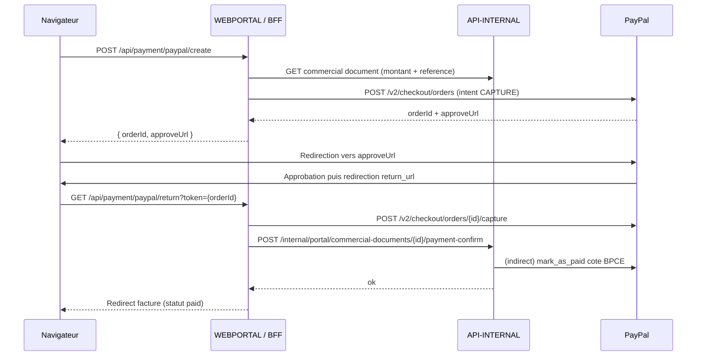
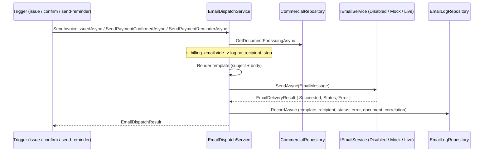

# V0.21 Canaux de paiement client

## Objet

La V0.21 ajoute au portail Kermaria deux canaux de paiement complementaires
pour les factures emises en V0.20 :

- virement bancaire (informationnel : IBAN, BIC, libelle, reference) ;
- paiement carte ou compte PayPal en ligne, en mode one-shot.

Elle ouvre egalement la premiere brique de communication transactionnelle
externe (e-mail), restee desactivee par defaut tant que la cible R740xd
n'est pas validee.

Les abonnements recurrents font l'objet du jalon **V0.22** separe.

## Architecture

```text
browser -> WEBPORTAL / BFF -> API-INTERNAL -> BPCE (mark_as_paid)
                          -> PayPal Orders API
                          -> SMTP (canal e-mail)
                                          -> MariaDB
```

Le navigateur n'appelle jamais PayPal cote serveur (Create Order). Il est
uniquement redirige vers l'URL d'approbation PayPal puis ramene sur le
portail apres approbation. Aucun envoi e-mail n'est declenche par le
navigateur : la dispatcher est strictement cote `API-INTERNAL`.

## Statut

Statut : **implemente dans le depot, en phase de tests** (PayPal `live`
et e-mail `live` desactives par defaut).

### Acquis livres

- section `Reglement` affichee sur le portail client uniquement pour les
  factures `issued` ou `paid`
  ([`apps/webportal/app/commercial-documents/[id]/page.tsx`](../apps/webportal/app/commercial-documents/[id]/page.tsx)) ;
- virement bancaire : IBAN, BIC, libelle beneficiaire et reference a
  indiquer presentes via les variables `BILLING_*` exposees par
  `getBillingConfig()`
  ([`apps/webportal/lib/runtime-config.ts`](../apps/webportal/lib/runtime-config.ts)) ;
- paiement carte / PayPal en ligne via PayPal Orders API v2
  ([`apps/webportal/lib/paypal.ts`](../apps/webportal/lib/paypal.ts)) :
  - `PAYPAL_MODE=sandbox|live` selectionne `api-m.sandbox.paypal.com` ou
    `api-m.paypal.com` ;
  - OAuth2 client credentials avec cache d'`access_token` jusqu'a
    `expires_in - 60s` ;
  - creation d'ordre `intent: CAPTURE` (one-shot, jamais recurrent) via
    `POST /v2/checkout/orders` ;
  - retour utilisateur `GET /api/payment/paypal/return?token=...` declenche
    la capture, propage a BPCE via `mark_as_paid` (cf. V0.20) puis a
    `commercial_documents.status` ;
- statut local `paid` ajoute aux types partages
  ([`packages/shared/src/index.ts`](../packages/shared/src/index.ts)) et au
  formatter ([`apps/webportal/lib/formatters.ts`](../apps/webportal/lib/formatters.ts)) ;
- apres paiement, le bouton PayPal est masque et le message "Cette facture
  a ete reglee. Merci pour votre paiement." est affiche.
- **Telechargement PDF cote portail client** : endpoint dedie
  `GET /internal/portal/commercial-documents/{id}/invoice/pdf` cote
  `API-INTERNAL`, ownership verifie via
  `ICommercialService.GetClientDocumentAsync` (404
  `PORTAL_DATA_NOT_FOUND` si non proprietaire, 404 `INVOICE_NOT_AVAILABLE`
  si statut != issued / paid) ; PDF servi depuis `bpce_invoices.pdf_content`
  (jamais d'acces BPCE direct cote portail). BFF :
  `GET /api/commercial-documents/[id]/invoice/pdf`. Bouton "Telecharger la
  facture (PDF)" dans le bloc Reglement.
- **Vue admin de suivi des paiements + marquage manuel** :
  - page `/admin/payments` : totaux a regler vs regle, filtre statut
    (Toutes / A regler / Reglees), table des factures emises avec lien
    fiche detail ;
  - endpoint `POST /internal/admin/commercial-documents/{id}/mark-as-paid`
    reutilise `IInvoiceIssuingService.ConfirmPaymentAsync` (meme flow BPCE
    `mark_as_paid` + statut local que la confirmation PayPal). Audit
    `commercial_document.mark_as_paid` ;
  - bouton "Marquer paye (hors PayPal)" sur la fiche document admin,
    visible uniquement quand `invoice.status != paid` ; remplace par
    "✓ Facture reglee" apres.
- **Canal e-mail transactionnel** :
  - `EMAIL_INTEGRATION_MODE` : `disabled` (defaut) | `mock` | `live` ;
    `live` envoi reel via `System.Net.Mail.SmtpClient` ; `mock` journalise
    sans envoyer ; `disabled` retourne no-op ;
  - destinataire : `customers.billing_email` uniquement ; si vide, statut
    `no_recipient` trace dans le journal sans envoi ;
  - 3 templates texte (fr) : `invoice_issued`, `payment_reminder`,
    `payment_confirmed` (`apps/api-internal/Services/Email/EmailTemplates.cs`) ;
  - declenchements automatiques :
    - `IssueInvoiceAsync(sendEmail=true)` -> `invoice_issued`
      (best-effort, n'echoue pas l'emission BPCE) ;
    - `ConfirmPaymentAsync` (PayPal ou marquage manuel) ->
      `payment_confirmed` (best-effort) ;
  - declenchement manuel admin : `POST /internal/admin/commercial-documents/{id}/send-reminder`
    -> `payment_reminder`. Audit `commercial_document.send_reminder`.
    Bouton "Envoyer une relance e-mail" sur la fiche admin quand
    statut = issued ;
  - journal d'envoi isole : table `email_messages` (migration
    `010_email_log`) avec template, recipient, subject, body, status,
    error_message, related_document_id, correlation_id, created_at,
    sent_at. Page `/admin/email-log` : 200 derniers envois avec statut
    succes/echec, message d'erreur en tooltip, lien vers le document,
    correlation visible.

## Variables d'environnement

| Variable | Role |
|---|---|
| `PAYPAL_MODE` | `sandbox` (defaut) / `live` |
| `PAYPAL_CLIENT_ID` | Client id de l'app PayPal |
| `PAYPAL_CLIENT_SECRET` | Secret de l'app PayPal, **secret strict** |
| `BILLING_IBAN` | IBAN affiche dans la section virement |
| `BILLING_BIC` | BIC / SWIFT affiche |
| `BILLING_PAYPAL_URL` | Fallback PayPal.me si l'integration PayPal Orders n'est pas configuree |
| `BILLING_TRANSFER_LABEL` | Beneficiaire affiche (defaut : raison sociale) |
| `EMAIL_INTEGRATION_MODE` | `disabled` (defaut) / `mock` / `live` |
| `SMTP_HOST` | Hote SMTP (obligatoire en mode `live`) |
| `SMTP_PORT` | Port SMTP, defaut 587 |
| `SMTP_USE_STARTTLS` | `true` (defaut) / `false` |
| `SMTP_USERNAME` | Identifiant SMTP (optionnel) |
| `SMTP_PASSWORD` | Mot de passe SMTP, **secret strict** |
| `SMTP_FROM_ADDRESS` | Adresse expediteur (obligatoire en mode `live`) |
| `SMTP_FROM_DISPLAY_NAME` | Nom expediteur, defaut `Kermaria` |
| `SMTP_TIMEOUT_MS` | Timeout SMTP en ms, defaut 10000, clamp [1000, 30000] |
| `PUBLIC_PORTAL_URL` | URL publique du portail, utilisee dans les liens des templates e-mail |

## Flux paiement PayPal



## Flux e-mail transactionnel



## Garde-fous

- aucun appel sortant tant que `PAYPAL_CLIENT_ID` n'est pas defini ;
- aucune URL PayPal exposee au navigateur ne contient de secret ;
- la confirmation cote `API-INTERNAL` n'accepte qu'un id de capture PayPal
  resolvable, jamais un montant arbitraire fourni par le client ;
- le mode `live` PayPal n'est jamais active sans validation explicite
  (cf. V1.0 beta 1) ;
- aucun envoi e-mail tant que `EMAIL_INTEGRATION_MODE != live` ;
- aucun PDF, ni numero de carte, n'est jamais place dans le corps d'un
  e-mail ; le montant total reste visible (contractuel) ;
- les credentials PayPal et le `SMTP_PASSWORD` sont rotes en meme temps
  que les autres secrets en V1.0 beta 1 ;
- ownership PDF cote portail : `GetClientDocumentAsync` est la seule porte
  d'entree ; un client ne peut pas telecharger le PDF d'un autre client
  meme avec un id devine.

## Comportement SEPA observe en sandbox

Lorsqu'un buyer francais regle via son compte bancaire dans PayPal, le
modal sandbox affiche un libelle "Mandat de prelevement SEPA - Recurrent".
Ce libelle est genere par PayPal cote modal et **n'implique aucun
prelevement recurrent reel** : l'`intent: CAPTURE` cote serveur est
strictement one-shot. En production, la majorite des buyers utilisent
leur solde PayPal ou une carte, sans declenchement de mandat.

Le vrai mode recurrent passera par l'API Subscriptions (V0.22).

## Limites volontaires

La V0.21 ne fait pas :

- d'abonnement recurrent PayPal (V0.22) ;
- de prelevement SEPA hors PayPal ;
- de rapprochement bancaire automatique ;
- d'envoi SMS, push, WebSocket ;
- d'integration comptable ;
- de templates HTML (texte uniquement) ;
- de pieces jointes e-mail (le PDF reste accessible via le portail).

Le SMTP reel reste branchable uniquement en preprod cible (V0.24).
