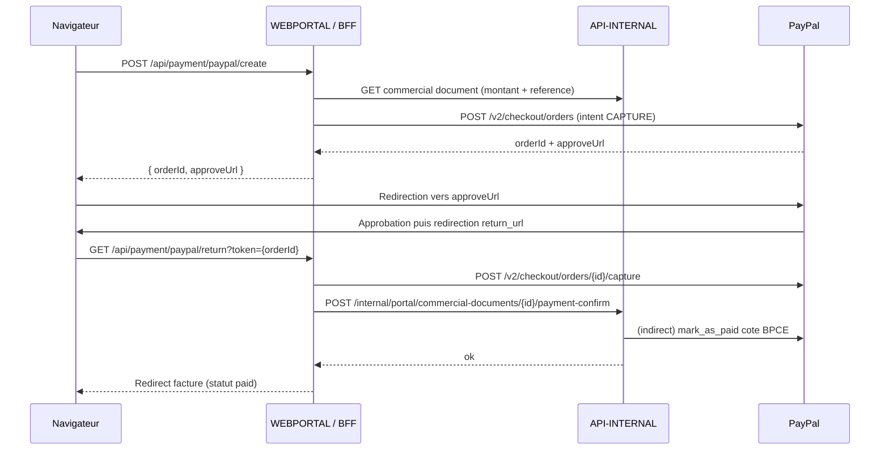

# V0.21 Canaux de paiement client

## Objet

La V0.21 ajoute au portail Kermaria deux canaux de paiement complementaires
pour les factures emises en V0.20 :

- virement bancaire (informationnel : IBAN, BIC, libelle, reference) ;
- paiement carte ou compte PayPal en ligne, en mode one-shot.

Elle ouvre egalement la premiere brique de communication transactionnelle
externe (e-mail), restee desactivee par defaut tant que la cible R740xd
n'est pas validee.

Les abonnements recurrents font l'objet du jalon **V0.22** separe.

## Architecture

```text
browser -> WEBPORTAL / BFF -> API-INTERNAL -> BPCE (mark_as_paid)
                          -> PayPal Orders API
                                          -> MariaDB
```

Le navigateur n'appelle jamais PayPal cote serveur (Create Order). Il est
uniquement redirige vers l'URL d'approbation PayPal puis ramene sur le
portail apres approbation.

## Statut

Statut : **partiellement implemente dans le depot, en phase de tests**.

### Acquis livres

- section `Reglement` affichee sur le portail client uniquement pour les
  factures `issued` ou `paid`
  ([`apps/webportal/app/commercial-documents/[id]/page.tsx`](../apps/webportal/app/commercial-documents/[id]/page.tsx)) ;
- virement bancaire : IBAN, BIC, libelle beneficiaire et reference a
  indiquer presentes via les variables `BILLING_*` exposees par
  `getBillingConfig()`
  ([`apps/webportal/lib/runtime-config.ts`](../apps/webportal/lib/runtime-config.ts)) ;
- paiement carte / PayPal en ligne via PayPal Orders API v2
  ([`apps/webportal/lib/paypal.ts`](../apps/webportal/lib/paypal.ts)) :
  - `PAYPAL_MODE=sandbox|live` selectionne `api-m.sandbox.paypal.com` ou
    `api-m.paypal.com` ;
  - OAuth2 client credentials avec cache d'`access_token` jusqu'a
    `expires_in - 60s` ;
  - creation d'ordre `intent: CAPTURE` (one-shot, jamais recurrent) via
    `POST /v2/checkout/orders` ;
  - retour utilisateur `GET /api/payment/paypal/return?token=...` declenche
    la capture, propage a BPCE via `mark_as_paid` (cf. V0.20) puis a
    `commercial_documents.status` ;
- statut local `paid` ajoute aux types partages
  ([`packages/shared/src/index.ts`](../packages/shared/src/index.ts)) et au
  formatter ([`apps/webportal/lib/formatters.ts`](../apps/webportal/lib/formatters.ts)) ;
- apres paiement, le bouton PayPal est masque et le message "Cette facture
  a ete reglee. Merci pour votre paiement." est affiche.

### Restent a finir avant cloture de V0.21

- **Telechargement PDF cote portail client** : endpoint dedie
  `GET /internal/portal/commercial-documents/{id}/invoice/pdf` cote
  `API-INTERNAL`, avec controle d'ownership par session client et reponse
  servie depuis le cache local ;
- **Vue admin de suivi des paiements** :
  - tableau filtrable des factures `issued`/`paid` avec date d'emission,
    montant, statut et lien PDF ;
  - bouton "Marquer comme payee" pour les paiements virement bancaire
    (appelle l'endpoint BPCE `mark_as_paid` + statut local) ;
- **Canal e-mail transactionnel** :
  - configuration SMTP via variables `SMTP_*` (host, port, user, password,
    from, replyTo) ;
  - templates minimaux en francais : facture emise, relance, confirmation
    encaissement ;
  - journal d'envoi isole, sans contenu sensible (jamais le PDF, jamais le
    montant complet dans le log) ;
  - desactive par defaut tant que `SMTP_HOST` n'est pas defini.

## Variables d'environnement

| Variable | Role |
|---|---|
| `PAYPAL_MODE` | `sandbox` (defaut) / `live` |
| `PAYPAL_CLIENT_ID` | Client id de l'app PayPal |
| `PAYPAL_CLIENT_SECRET` | Secret de l'app PayPal, **secret strict** |
| `BILLING_IBAN` | IBAN affiche dans la section virement |
| `BILLING_BIC` | BIC / SWIFT affiche |
| `BILLING_PAYPAL_URL` | Fallback PayPal.me si l'integration PayPal Orders n'est pas configuree |
| `BILLING_TRANSFER_LABEL` | Beneficiaire affiche (defaut : raison sociale) |
| `SMTP_HOST` (a venir) | Hote SMTP, vide = canal e-mail desactive |
| `SMTP_PORT`, `SMTP_USER`, `SMTP_PASSWORD`, `SMTP_FROM`, `SMTP_REPLY_TO` (a venir) | Config SMTP standard |

## Flux paiement PayPal



## Garde-fous

- aucun appel sortant tant que `PAYPAL_CLIENT_ID` n'est pas defini ;
- aucune URL PayPal exposee au navigateur ne contient de secret ;
- la confirmation cote `API-INTERNAL` n'accepte qu'un id de capture PayPal
  resolvable, jamais un montant arbitraire fourni par le client ;
- le mode `live` PayPal n'est jamais active sans validation explicite
  (cf. V0.23b) ;
- aucun PDF, ni montant complet, ne doit transiter dans les logs e-mail
  futurs ;
- les credentials PayPal sont rotes en meme temps que les autres secrets
  en V0.23b.

## Comportement SEPA observe en sandbox

Lorsqu'un buyer francais regle via son compte bancaire dans PayPal, le
modal sandbox affiche un libelle "Mandat de prelevement SEPA - Recurrent".
Ce libelle est genere par PayPal cote modal et **n'implique aucun
prelevement recurrent reel** : l'`intent: CAPTURE` cote serveur est
strictement one-shot. En production, la majorite des buyers utilisent
leur solde PayPal ou une carte, sans declenchement de mandat.

Le vrai mode recurrent passera par l'API Subscriptions (V0.22).

## Limites volontaires

La V0.21 ne fait pas :

- d'abonnement recurrent PayPal (V0.22) ;
- de prelevement SEPA hors PayPal ;
- de rapprochement bancaire automatique ;
- de SMS, push, WebSocket ;
- d'integration comptable.

Le SMTP reel reste branchable uniquement en preprod cible (V0.23a).
